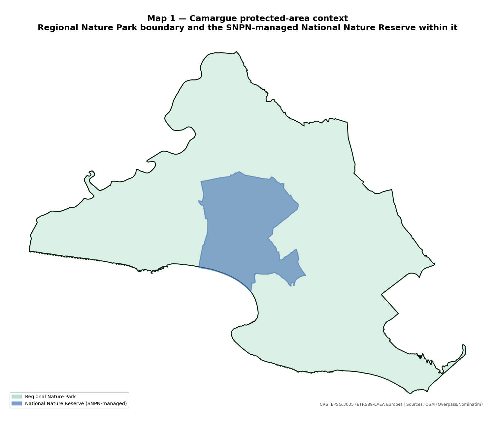
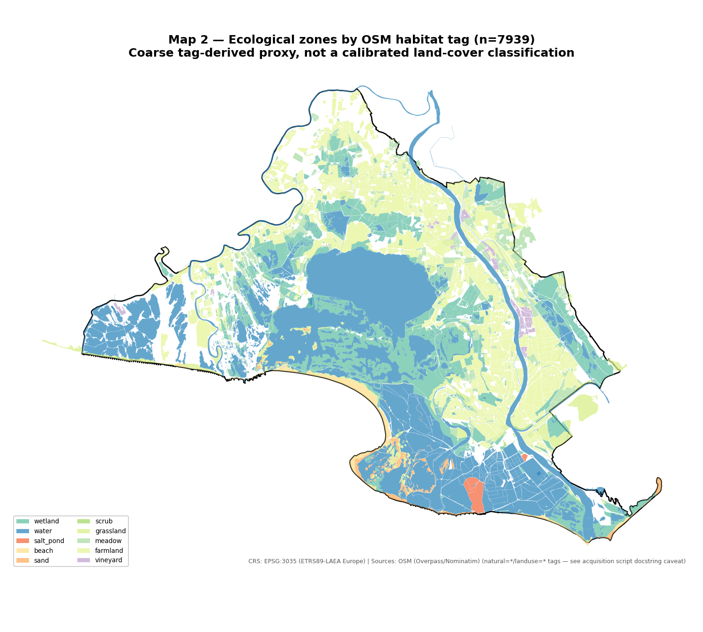
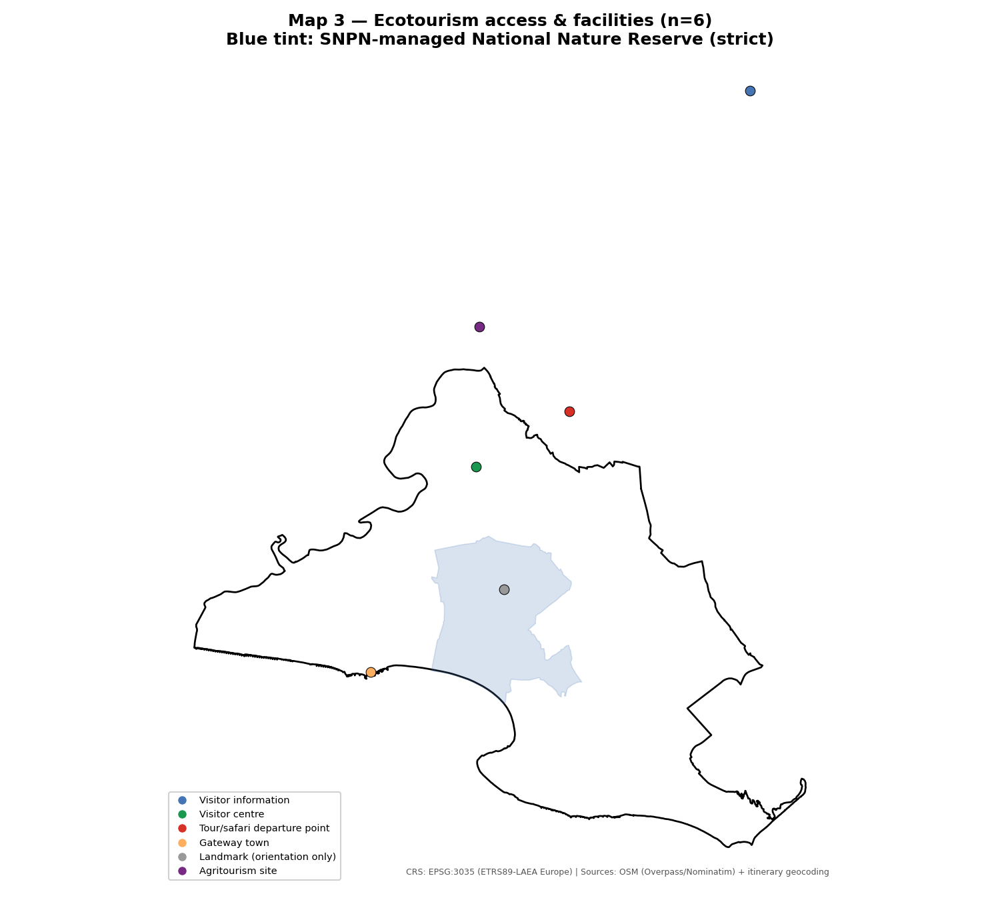

Camargue ecotourism: field notes from a May–June 2025 trip, fact-checked against Wikipedia and Wikidata, and what it could mean for the Greater Côa Valley

Linda Angulo Lopez, compiled 25 August 2026, from a personal trip itinerary (Avignon and the Camargue, 24 May – 17 June 2025) supplied directly in conversation rather than a `survey123/` folder. Species and site facts below are checked against the English Wikipedia articles for Camargue, Camargue horse, and Camargue cattle, then cross-checked against the corresponding Wikidata entities and French Wikipedia (Réserve naturelle nationale de Camargue), per the specific fact-checking instruction attached to this trip. The comparative section follows the same brief as `safari-upscaling-coa-valley-limpopo.md`: this is written to support strategic expansion of the Greater Côa Valley initiative, not as description for its own sake — see `[[coa-valley-strategic-expansion-intent]]`.

## Page 1 — Visit header

| Field | Value |
|---|---|
| Trip dates | 24 May – 17 June 2025 |
| Region | Avignon and the Camargue, Bouches-du-Rhône / Gard, southern France |
| Source | Personal calendar export (Google Calendar), pasted into conversation — not a `survey123/` photo folder. **No field photography for this trip is on file**; all observations below are Linda's own recalled description, fact-checked against external sources rather than against her own photos |
| Itinerary (relevant stops) | 24 May: Office de Tourisme d'Avignon, 41 Cr Jean Jaurès, 84000 Avignon. 1 June: drive to Camargue Regional Nature Park. 14–15 June: "Safari en 4x4 dans le Parc naturel de Camargue," departing 1 Rue Emile Fassin, 13200 Arles (two-day booking, day 1 start 14:30). 16–17 June: guided lavender distillery visit, un Mas en Provence, Le Mas Neuf, Avenue du Félibrige, 30127 Bellegarde (two-day booking) |
| GPS location | Not captured — no geotagged photos exist for this trip; only street addresses from the booking calendar |
| Weather / light conditions | Not documented |

**Note on which stop the wildlife sighting belongs to.** Linda's note — "I saw wild horses and bulls and cattle" — is attached in the calendar export to the tail end of the 16–17 June lavender-distillery listing, but it's treated here as belonging to the 14–15 June 4x4 safari through the Parc naturel de Camargue instead: a marshland safari is the activity that puts free-ranging horses and cattle in view, and Bellegarde's distillery is a different site type (agricultural, not wetland/pasture) about 15 km from the Camargue's core marshes. Worth confirming with Linda whether this reading is right, per the project's standing rule to ask rather than silently assume when a note's date/site attribution isn't clean-cut (see `[[coa-valley-field-notes-style]]`).

## Species observations

| # | Functional group | Species / breed | Fact-checked notes | Confidence |
|---|---|---|---|---|
| 1 | Semi-feral equid | Camargue horse (*Equus caballus*, Camargue breed; Wikidata [Q846312](https://www.wikidata.org/wiki/Q846312)) | Not a wild species — a registered, semi-feral breed. Population 14,509 (2018, DAD-IS via Wikidata); FAO conservation status "not at risk" (2023). Born dark grey/brown, turns white with age; 135–150 cm, 350–500 kg; hard hooves adapted to marsh ground. Managed in *manades* (semi-feral herds) under mounted herders (*gardians*), rounded up annually for branding, health checks, and gelding. Stud book created 1978; breed society formed 1964. Traditional mount of the gardians themselves, and separately used directly in equestrian tourism (Wikidata lists "equestrian tourism" as a documented use) | High — well-documented breed, "wild horses" as described is the common but technically loose framing of a managed semi-feral population, worth stating plainly rather than passing along as true wildness |
| 2 | Semi-feral bovine (intact bulls) | Camargue cattle, *taureaux* (uncastrated bulls bred specifically for fighting-bull use; same breed as #3) | Black-coated, raised in the same manade system as the herd cattle below but specifically selected and trained as *taureaux de combat*. Two sources checked for this note disagree on what that use is, and the disagreement is worth stating rather than smoothing over: the main Camargue Wikipedia article says gardians "rear the region's cattle for fighting bulls for regional use **and for export to Spain**, as well as sheep," while the dedicated Camargue cattle article and independent tourism sources describe the domestic French use as *course camarguaise* specifically — a bloodless sport (a *raseteur* on foot snatches a cockade from the bull's horns; the bull returns to its herd afterward, fights perhaps half a dozen times a year, and is retired to pasture around age 14–15) explicitly distinguished from Spanish-style *corrida*, where the bull is killed. None of the sources checked say what happens to the animals exported to Spain specifically — whether they enter Spain's own bloodless traditions or its lethal corrida circuit is not resolved here, and shouldn't be assumed either way | Medium — "bulls" as a distinct sighting most likely reflects seeing intact males within a mixed manade herd from the safari vehicle, rather than a separate species; treated here as the same breed as #3, differently described. Low confidence specifically on the export-to-Spain end use — see the ethics section below |
| 3 | Semi-feral bovine (herd cattle) | Camargue cattle (*race Camarguaise*; Wikidata [Q2934636](https://www.wikidata.org/wiki/Q2934636)) | FAO status "not at risk" (2023). Population reporting is inconsistent across the sources checked and worth flagging rather than smoothing over: 5,950 head (2004), 5,332 head (2014), then over 20,000 head by a 2020 figure — a nearly fourfold jump in six years that most likely reflects a change in what's being counted (e.g. total breed registry vs. Camargue-region herds only) rather than real population growth of that scale; not resolved in this pass. Managed extensively in manades under gardians as working stock, not a passive rewilding herd: used for course camarguaise/export breeding (row 2), beef (~2,000 head sold/year), vegetation and wetland management by grazing, and as a tourism draw in its own right. Gardians run sheep alongside cattle in the same pastoral economy ("as well as sheep," per the main Camargue Wikipedia article), for wool/meat — not covered further here since no sheep sighting was reported | Medium-high on breed identity and use; low confidence on the specific population figure to quote, given the unreconciled range above |
| 4 | Wetland birds (context, not a direct sighting reported) | Greater flamingo and 400+ other bird species | Camargue's brine ponds are one of Europe's few greater-flamingo habitats; the area is a BirdLife International Important Bird Area (IBA) | Not observed/reported by Linda for this trip — included here only as site context for the comparison section below |

## Site and designation facts

Multiple, stacked protection designations cover overlapping footprints of the same landscape — worth laying out precisely since the comparison section below leans on exactly this stacking:

- **Parc naturel régional de Camargue** — regional nature park, designated 1970, 820 km² (82,000 ha).
- **Réserve naturelle nationale de Camargue** — the core protected wetland inside the regional park: established 1927 as a zoological/botanical reserve, formally classified as a national nature reserve by ministerial decree on 24 April 1975, 13,232 ha, centred on the Étang de Vaccarès. State-owned land, managed by the **Société nationale de protection de la nature (SNPN)** — a nonprofit, not a government agency directly — under a Director's Council chaired by the Prefect of Bouches-du-Rhône and a separate Scientific Council; current management plan covers 2023–2027.
- **Ramsar Wetland of International Importance** — designated 1 December 1986 (Ramsar site #346).
- **UNESCO Biosphere Reserve** — designated 1977 under the Man and the Biosphere programme, revised in 2006 to extend coverage to the entire biogeographic Rhône delta rather than the smaller original footprint; co-administered with the regional park authority. Twinned with Doñana National Park (Spain) and the Danube Delta (Romania).
- Recognised as an Important Bird Area by BirdLife International, on the strength of 400+ recorded bird species and its greater-flamingo population.

None of the sources checked for this note gave a total annual visitor count for the Camargue as a tourism destination, or a regulatory framework specifically for 4x4 safari operators (several independently branded operators — Camargue Alpilles Safari, Camargue Safari Tours, Safari Camargue Passion — run guided 4x4 tours departing from Arles, Aigues-Mortes, and elsewhere around the park's edge). That gap is worth naming rather than papering over: the comparison below works from the governance and land-use structure, which is well documented, not from visitor-volume figures, which aren't.

**Companion QGIS map:** `research/camargue-comparison/qgis/camargue_ecotourism.qgz` lays out three layers built from this same fact base — `protected_areas` (the regional park and national reserve boundaries above, categorized), `ecological_zones` (7,939 OSM-tagged habitat polygons — wetland, salt pond, water, scrub, beach/sand, farmland, meadow, grassland, vineyard — a coarse tag-based ecological-region proxy, not a calibrated land-cover classification), and `ecotourism_facilities` (six points: the Avignon tourism office, the park's Musée de la Camargue visitor centre, the Arles 4x4-safari departure point, the Saintes-Maries-de-la-Mer gateway town, Étang de Vaccarès as an orientation landmark, and the Bellegarde lavender-distillery stop — all geocoded from Linda's own itinerary, sourced in `research/camargue-comparison/scripts/acquire_camargue_layers.py`). La Capelière, the SNPN reserve's own visitor information point, was searched for and found no Nominatim match — left out rather than placed by guesswork.

**Methodology for the maps below:** built with `research/camargue-comparison/scripts/generate_maps.py`, matplotlib/GeoPandas on the same three `camargue_layers.gpkg` layers as the QGIS deliverable, reprojected to EPSG:3035 (ETRS89-LAEA Europe, this project's standard metric CRS). Facility-in-boundary checks (Map 3's caption below) are computed directly against the polygon geometries, not eyeballed.

*Map 1. Regional Nature Park boundary (82,000 ha) and the SNPN-managed National Nature Reserve within it (13,232 ha).*

*Map 2. 7,939 OSM-tagged habitat polygons — a coarse tag-derived proxy, not a calibrated land-cover classification (see caveat above).*

*Map 3. All six facility points against the national reserve boundary. Only three (Musée de la Camargue, Saintes-Maries-de-la-Mer, Étang de Vaccarès) fall inside the regional park itself — the Avignon tourism office, the Arles safari departure point, and the Bellegarde distillery are real gateway/departure points outside it, not park-internal facilities.*

## Free herds vs. working herds: an ethical distinction worth not skipping

It would be easy to read "semi-feral horses and cattle managed by herders" and treat the Camargue and the Côa Valley's Sorraia horses and Tauros cattle as the same kind of thing. They aren't, and the difference matters for what this project should and shouldn't borrow.

The Côa Valley's Sorraia horses and Tauros cattle at Ermo das Águias (per `safari-upscaling-coa-valley-limpopo.md`'s species baseline) exist there for an ecological function: landscape-scale grazing management as part of a rewilding programme, with tourism viewing as a secondary benefit. They are not bred, selected, or exported for any use that involves fighting, spectacle, or a lethal endpoint. Whatever the imprecision in calling them "free" (they're still fenced, managed, and monitored, not truly wild), their instrumentalization stops at conservation grazing.

The Camargue's horses and cattle are, by contrast, explicitly working stock inside a commercial-cultural pastoral economy. The gardians who herd them are cowherds by trade, and the main Camargue Wikipedia article states plainly that they "rear the region's cattle for fighting bulls for regional use and for export to Spain, as well as sheep." Three distinct threads sit inside that one sentence, worth pulling apart rather than reading as a single fact:

- **Regional use (France):** *course camarguaise*, and per the independent tourism/culture sources checked for this note, this specifically is bloodless — no bull is killed, the animal returns to its herd after each event, fights perhaps half a dozen times a year at most, and is retired to pasture around age 14–15. Some retired bulls are reportedly buried standing, facing the sea, on the death of a particularly celebrated animal — a detail that signals real cultural reverence for these specific animals, not casual disposability.
- **Export to Spain:** the main Wikipedia article names this directly, but no source checked in this pass says what these exported animals are used for once in Spain. Spain's own bullfighting culture includes both non-lethal traditions (e.g. *recortadores*) and the lethal *corrida*, and this note cannot responsibly assume which one applies to Camargue-bred exports without a source that actually says so. Flagged here as an open, unresolved point rather than glossed over in either direction.
- **Sheep**, raised in the same manade-adjacent pastoral system for wool and meat — a genuinely separate, non-spectacle agricultural use, mentioned in the same sentence but not otherwise connected to the fighting-bull question.

The horses are working animals in a more direct sense still: they are the gardians' actual mounts, used to herd the cattle. "Wild horses" undersells both the semi-feral breed-management reality already flagged in row 1 above, and this further layer — these are, in a real sense, ranch horses.

**Why this matters for the comparison below:** the Camargue model this note draws on for tourism-format and land-tenure lessons is inseparable, in the sources checked, from a bull-breeding economy whose regional form is bloodless but whose export dimension is unverified and could plausibly not be. Rewilding Portugal's own positioning is explicitly a rewilding and animal-welfare-conscious one; adopting Camargue's *safari format and land-tenure structure* doesn't require adopting its *cattle-for-export-fighting economic model*, and this note treats those as separable rather than a package deal. The implications below are written with that separation in mind.

## What this could mean for the Greater Côa Valley

Each point below follows the standing brief for this project's comparative desk studies: land it in a concrete, adoptable implication for the Côa Valley initiative, not just a description of how Camargue does it.

**1. A working-landscape model, not a land-purchase model.** Camargue's core protection (13,232 ha) sits on state-owned land managed by an NGO, but the much larger 82,000 ha regional park around it is not a single acquired estate — it's a zoning and co-management designation layered over land that private *manade* ranchers continue to work, graze, and profit from. That's structurally different from the private-purchase, willing-seller model this project's own `safari-upscaling-coa-valley-limpopo.md` documents as the only mechanism currently in use for Côa Valley expansion (Faia Brava, ATN's ~2,500 ha ambition), and different again from the fragmented ZCA/ZCM/ZCT hunting-zone tenure that note treats as a barrier. **Implication:** the barrier-one fragmentation problem in the Limpopo note assumes consolidation has to mean acquisition. Camargue is a working precedent for the alternative — a regional-park-style zoning designation laid over existing hunting-zone concessionaires and private landowners who keep their current land use, rather than a requirement that Rewilding Portugal or ATN buy the land outright. Worth investigating as a parallel track to acquisition, not a replacement for it.

**2. The safari product doesn't need Big-Five-scale species — it needs a working-animal narrative.** Camargue's 4x4 safaris sell semi-feral horses and cattle, not lions or elephants — animals that are, functionally, exactly the kind of thing the Côa Valley already has on the ground. This project's own species baseline (cited in the Limpopo note) already lists more than 40 Sorraia horses and roughly 15–32 Tauros cattle at Ermo das Águias, the same rough category of semi-wild, breed-standard equid and bovine that the Camargue tourism product is built on. **Implication:** a Camargue-style guided vehicle safari through the Ermo das Águias rewilding area is a product this project could plausibly stand up now, on species already present, without waiting on land consolidation, wolf visibility, or any of the multi-decade barriers the Limpopo note identifies. This is the single most directly transferable and immediately actionable point in this comparison — and it transfers cleanly precisely because it borrows the *safari format*, not the *working-herd economy* behind it: the Côa's Sorraia horses and Tauros cattle are conservation-grazing animals, not fighting-bull breeding stock, so this product can be built without importing the unresolved export-to-Spain question raised in the ethics section above.

**3. The cultural-narrative layer is doing real work, separate from the wildlife itself.** Camargue's tourism identity bundles the *gardian* herding culture, the bloodless *course camarguaise* (explicitly not Spanish-style bullfighting — a distinction the sources are careful to draw), and an agritourism circuit (the lavender distillery Linda's own itinerary included, alongside Avignon heritage tourism) into one regional story, rather than marketing the marshland and the animals as a standalone nature product. **Implication:** the Côa Valley's own emerging semi-wild herds could be marketed the same way — as a living continuation of Iberian pastoral culture and native-breed conservation (Sorraia horse, Tauros cattle as tarpan/aurochs proxies), bundled with the region's existing rock-art heritage tourism and Douro wine-country circuit, rather than pitched purely as a conservation/rewilding product to a narrower ecotourism audience. This is a point to borrow selectively, though: the *gardian* narrative works as a cultural-heritage hook precisely because it's tied to a specific, named human tradition (herding, horsemanship, land stewardship), and the Côa Valley can tell an equivalent story around its own herding/rewilding-ranger culture without also adopting the fighting-bull-breeding economic layer that underwrites the Camargue's own version of it — the ethics section above is the reason to be explicit about that boundary rather than let it go unstated in any future marketing material.

**4. An NGO-manages/state-owns governance template, at a scale worth studying.** SNPN's management of the 13,232 ha core reserve — under a Prefect-chaired Director's Council and a separate Scientific Council, on land the French state acquired specifically to hand to that management — is a larger, more formalised version of the ATN/Faia Brava model this project already runs at a much smaller scale (214.6–856.87 ha, depending on which figure from the Limpopo note is used). **Implication:** as ATN and Rewilding Portugal plan further expansion, SNPN's governance structure (not its land-purchase mechanism, which doesn't apply — the state already owned the land) is a concrete template worth reviewing for what a larger-scale, multi-body Côa Valley governance structure could look like once the estate outgrows single-organisation management.

**5. Designation-stacking as a funding and marketing multiplier.** Camargue stacks five distinct designations — Regional Nature Park (1970), National Nature Reserve (1927/1975), Ramsar Wetland (1986), UNESCO Biosphere Reserve (1977, revised 2006), and BirdLife Important Bird Area — over the same landscape, each opening a different funding, legal-protection, or marketing channel. The Côa Valley currently holds one comparable international designation, UNESCO World Heritage status for the rock art (1998, per `movimento-salvaguarda-gravuras-foz-coa.md`), and nothing else in this class. Given this project's own documented bird guild (cinereous, Egyptian, and griffon vulture, Bonelli's and golden eagle, black stork, per the Limpopo note's species baseline), an Important Bird Area nomination in particular looks like unclaimed low-hanging fruit rather than a stretch. **Implication:** investigate whether an IBA nomination, and separately whether a UNESCO Biosphere Reserve nomination built outward from the existing rock-art World Heritage core, are realistic near-term applications — both are designation types that don't require new land acquisition, only documentation of what's already there.

**6. Twinning as a lower-barrier alternative to the Limpopo note's fence-removal model.** Camargue's Biosphere Reserve is formally twinned with Doñana National Park (Spain) and the Danube Delta (Romania) — a knowledge- and marketing-sharing partnership between comparably-scaled protected wetlands, not a land-tenure merger. The Limpopo note's GLTFCA comparison concluded the fence-removal mechanism that built Kruger–Limpopo–Gonarezhou into one 3.7-million-ha park has no Côa equivalent, because the Côa study area doesn't border a national park at that scale. Twinning is a structurally different, much lower-barrier mechanism that doesn't require a shared border or shared ownership at all. **Implication:** a formal sister-reserve relationship between the Côa Valley and a similarly-scaled European rewilding or wetland reserve (Camargue itself is one candidate, given the semi-wild-breed parallel already drawn above) is achievable on a near-term timeline, unlike consolidation or acquisition, and could be pursued in parallel with the slower land-based strategies the other five points describe.

## Open items

- Confirm with Linda whether the wild-horses/bulls/cattle sighting belongs to the 14–15 June safari (as assumed above) or genuinely to the 16–17 June distillery stop.
- The Camargue cattle population figures (5,950 in 2004; 5,332 in 2014; 20,000+ by 2020) don't reconcile in the sources checked for this note — worth a follow-up pass if an exact current figure is needed for anything citation-grade.
- No visitor-volume or safari-operator-regulation figures were found for the Camargue in this pass; if a future note wants to quantify "how big is Camargue's ecotourism economy" for a direct scale comparison to the Côa Valley's own visitor numbers (401,387 total at the Parque Arqueológico do Vale do Côa across 30 years, per `douro-vs-coa-tourism-dam-counterfactual.md`), that's a distinct research task, not covered here.
- No field photography exists for this trip; if Linda has phone photos from the safari or distillery days not yet uploaded anywhere, adding them would let a future pass replace the "not observed/reported" flamingo line and firm up the horses/bulls/cattle sighting with an actual image rather than recalled text.
- The export-to-Spain end use for Camargue fighting bulls (bloodless tradition vs. lethal corrida) is unresolved in the sources checked for this note — see the ethics section above. Worth a targeted follow-up search (French agricultural-export statistics, or Spanish bullfighting-breed registries) if this project ever needs to state it more precisely than "unverified."
- `research/camargue-comparison/data/processed/camargue_layers.gpkg`'s `ecological_zones` layer is an OSM-tag proxy (natural=*/landuse=* only), not a CORINE Land Cover pull — a future pass could substitute or supplement it with CORINE classes for a more rigorously classified habitat layer if this map is developed further.

## Cross-references

- `safari-upscaling-coa-valley-limpopo.md` — the species baseline (Sorraia horse, Tauros cattle counts) and land-tenure/barrier framework this note's implications build directly on; also the source of the "no fence-removal equivalent" finding that point 6 above responds to with an alternative mechanism.
- `douro-vs-coa-tourism-dam-counterfactual.md` — the UNESCO World Heritage designation and visitor-count figures for the Côa's existing tourism identity, referenced in points 5 and the Open items.
- `movimento-salvaguarda-gravuras-foz-coa.md` — the 1998 UNESCO World Heritage inscription this note treats as the Côa Valley's one existing international designation.
- `wildlife-relations-portugal-vs-south-africa.md` — the private-reserve/ATN governance model this note's point 4 compares SNPN's structure against.

## References

### Camargue geography and designations
- [Camargue — Wikipedia (en)](https://en.wikipedia.org/wiki/Camargue)
- [Parc naturel régional de Camargue — Wikipedia (en)](https://en.wikipedia.org/wiki/Parc_naturel_r%C3%A9gional_de_Camargue)
- [Réserve naturelle nationale de Camargue — Wikipédia (fr)](https://fr.wikipedia.org/wiki/R%C3%A9serve_naturelle_nationale_de_Camargue)
- [Camargue (delta du Rhône) — UNESCO Man and the Biosphere Programme](https://www.unesco.org/en/mab/camargue-delta-du-rhone)
- [Réserve de biosphère Camargue — Parc naturel régional de Camargue](https://www.parc-camargue.fr/reserve-biosphere-camargue.html)

### Camargue horse and cattle breeds
- [Camargue horse — Wikipedia (en)](https://en.wikipedia.org/wiki/Camargue_horse)
- [Camargue horse — Wikidata (Q846312)](https://www.wikidata.org/wiki/Q846312)
- [Camargue cattle — Wikipedia (en)](https://en.wikipedia.org/wiki/Camargue_cattle)
- [Camargue cattle — Wikidata (Q2934636)](https://www.wikidata.org/wiki/Q2934636)

### Gardians, fighting bulls, and course camarguaise (ethics section)
- [A Friendlier Form of Bullfighting in the 'Wild West' of France — Atlas Obscura](https://www.atlasobscura.com/articles/course-camarguaise-french-bullfighting)
- [Camargue Rules: Cowboys, Bulls and the Course Camarguaise — France Today](https://francetoday.com/culture/camargue-rules/)
- [Is It Wrong to Attend La Course Camarguaise? — France Travel Tips](https://www.francetraveltips.com/is-it-wrong-to-attend-la-course-camarguaise/)
- [Camargue bullfighting: between sport and heritage — Provence-Alpes-Côte d'Azur Tourism](https://provence-alpes-cotedazur.com/en/things-to-do/events/camargue-bullfighting/)

### This project's own prior desk research (cross-referenced above)
- `field-trips/deskStudy/safari-upscaling-coa-valley-limpopo.md`
- `field-trips/deskStudy/douro-vs-coa-tourism-dam-counterfactual.md`
- `field-trips/deskStudy/movimento-salvaguarda-gravuras-foz-coa.md`
- `field-trips/deskStudy/wildlife-relations-portugal-vs-south-africa.md`

### QGIS deliverable (this note's companion map)
- `research/camargue-comparison/qgis/camargue_ecotourism.qgz` — ecological zones, protected-area boundaries, ecotourism access/facility points
- `research/camargue-comparison/scripts/acquire_camargue_layers.py` — OSM/Nominatim/Overpass data acquisition, with sourcing documented per layer
- `research/camargue-comparison/scripts/build_camargue_qgis_project.py` — PyQGIS project assembly/styling
