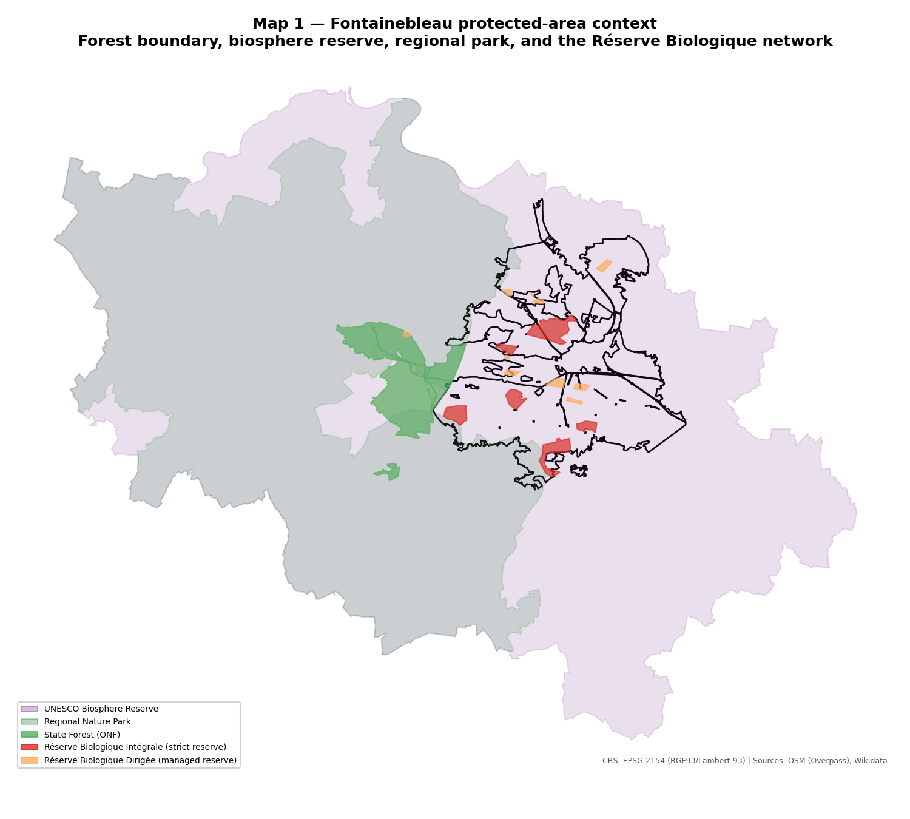
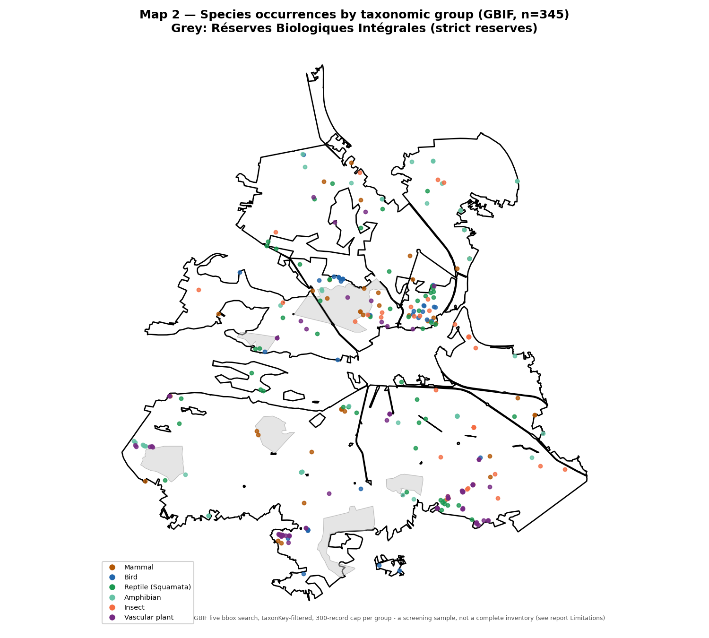
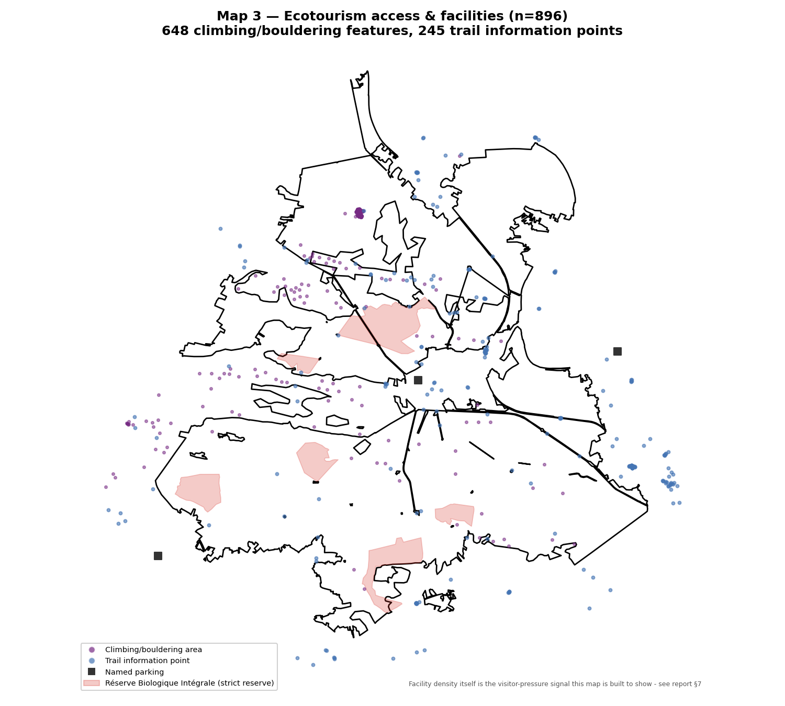

Fontainebleau: 25 years of ecological familiarity, fact-checked against Wikidata, OpenStreetMap and GBIF, and what its visitor-pressure management could mean for the Greater Côa Valley

Linda Angulo Lopez, compiled 25 August 2026, from 25 years of residence in Fontainebleau, France, during which I did volunteer ecological consulting and worked as a field guide. Third in this project's comparative desk-study series, alongside `camargue-ecotourism-implications-coa-valley.md` and `safari-upscaling-coa-valley-limpopo.md`, same brief: this is written to support strategic expansion of the Greater Côa Valley initiative, not description for its own sake, see `[[coa-valley-strategic-expansion-intent]]`.

**What this document is, stated plainly first.** This is not a dated field-visit report. No site visit, photograph, or field measurement from my 25 years in Fontainebleau is on file for this study, and I am not inventing any (no specific site names I personally guided, no dates, no species lists from memory). What I can state honestly: I lived there 25 years, did volunteer ecological consulting, and worked as a field guide, real, lived familiarity with this landscape, not something this document tries to itemise beyond what's true. Everything else below is Sourced (a named dataset, cited), Derived (computed by this study's own scripts from sourced data) or Inferred (this study's own reasoning, stated as such).

## Page 1 - Site header

| Field | Value |
|---|---|
| Personal context | 25 years' residence in Fontainebleau, France; volunteer ecological consulting; field guide work. No dated visit, no field photography on file for this study |
| Site | Forêt de Fontainebleau, Seine-et-Marne, Île-de-France, roughly 60 km southeast of Paris |
| Source | OpenStreetMap (Overpass API), Wikidata, GBIF Occurrence API, all confirmed reachable and queried live for this study, 25 August 2026 |
| Companion data and QGIS deliverables | `research/fontainebleau-comparison/` (scripts, GeoPackages, `.qgz` project, three report maps) |

**A source-reachability note worth stating directly, not burying.** INPN (`inpn.mnhn.fr`) and its taxonomic reference service TAXREF, France's official national biodiversity inventory and the natural authoritative source for this exact study, returned an HTTP 403 Cloudflare bot-check from this working environment, the same failure this project's own `research/eco-connectivity/scripts/acquire_unesco_heritage_zones.py` already documented for `whc.unesco.org`. INPN is run by the Muséum national d'Histoire naturelle, one of my own former employers (see `/my-cv`), which makes it a genuinely notable gap rather than an incidental one: the one authoritative source this study couldn't reach is the one built by the institution I used to work for. `data.gouv.fr`, France's open-data portal, is reachable and a plausible manual-upgrade path, not verified to hold a specific usable dataset in this pass.

## Boundary and area, fact-checked

The core state forest resolves, from its own OSM relation (3236785, `landuse=forest`, matching Wikidata's forest-of-Fontainebleau item Q1293678), to 153.0 km² (15,303 ha), a MultiPolygon in 20 real fragments, not a parsing artefact, roads, villages and private inholdings genuinely cut through the nominal forest boundary. This is only 54.5% of the 280.92 km² figure Wikidata's own P2046 claim states for the same Q1293678 item. I have not resolved this discrepancy definitively, but the most likely explanation, stated as a hypothesis and not a fact, is that the larger figure describes the broader "massif forestier de Fontainebleau", including the separately-mapped Forêt Domaniale des Trois Pignons (33.9 km², its own OSM relation, tagged `source=IGN Forêts Publiques`) and other associated forest blocks, while the OSM relation used here captures the core state forest alone. Both figures are stated, neither is picked as more correct without better evidence.

## Species observations (GBIF, live query)

345 occurrence records, pulled live from GBIF's public Occurrence API and clipped to the forest boundary, across six taxonomic groups. One genuine data-pipeline error surfaced and got caught during acquisition, worth reporting because it's the kind of thing that's easy to miss: GBIF's occurrence-search endpoint silently ignores free-text `class=`/`kingdom=` filter values (a request for `class=Aves` and one for `class=Mammalia` returned byte-identical results, confirmed by direct comparison), it does not error, it just returns the unfiltered bbox pool regardless of the value sent. The working filter is `taxonKey`, GBIF's own numeric backbone-taxonomy identifier, verified individually via `/v1/species/match` before use. Reptilia has no single clean backbone class key in GBIF's checklist, a real consequence of reptiles being paraphyletic without birds in modern taxonomy, so the reptile group here is Squamata (lizards and snakes) specifically, not all reptiles.

| # | Group | Records | Notable species found | Confidence |
|---|---|---|---|---|
| 1 | Vascular plant (Tracheophyta) | 94 | *Ruscus aculeatus*, *Anemone nemorosa*, *Hornungia petraea*, *Carex humilis* | High, GBIF-sourced |
| 2 | Reptile (Squamata) | 57 | *Lacerta bilineata* (western green lizard), *Podarcis muralis* (wall lizard), *Vipera aspis* (asp viper), *Anguis fragilis* (slow worm) | High, GBIF-sourced. *Lacerta agilis*, the sand lizard most associated with Fontainebleau's sand-heathland "platières" in general literature, did not appear in this 300-record capped pull, absence from a capped sample is not evidence of absence, flagged in Open items |
| 3 | Amphibian | 56 | *Rana dalmatina* (agile frog), *Lissotriton helveticus* (palmate newt), *Bufo bufo* (common toad) | High, GBIF-sourced |
| 4 | Insect | 52 | *Nemobius sylvestris* (wood cricket), *Thaumetopoea pityocampa* (pine processionary moth, a real forest-management concern in this region) | High, GBIF-sourced |
| 5 | Mammal | 46 | *Sus scrofa* (wild boar), *Vulpes vulpes* (red fox), *Capreolus capreolus* (roe deer), *Sciurus vulgaris* (red squirrel), *Pipistrellus pipistrellus* (bat) | High, GBIF-sourced |
| 6 | Bird | 40 | *Cuculus canorus* (cuckoo), *Dendrocopos major* (great spotted woodpecker) | High, GBIF-sourced |

This is a screening sample (300-record page cap per taxonomic group, well below GBIF's actual bbox totals, which range from roughly 13,000 Squamata records to over 500,000 Tracheophyta records for this area alone), not a complete species inventory, and it should not be read as one.

## Protected-area network, fact-checked

Twenty records, all with real OSM boundary polygons (no Wikidata point-only records here, a difference worth noting from the Limpopo comparison, where most protected areas were points).

- **Réserve de biosphère de Fontainebleau et du Gâtinais** - UNESCO Biosphere Reserve, 149,587 ha computed.
- **Parc naturel régional du Gâtinais français** - Regional Nature Park, 76,289 ha computed, the territory that, together with the state forest, forms the biosphere reserve's footprint.
- **Forêt Domaniale des Trois Pignons** - a separate, associated state forest, 3,394 ha computed, itself a major bouldering area.
- **Seventeen named Réserves Biologiques** within the state forest, ONF's strict-protection mechanism, split into two tiers: 8 Réserves Biologiques Intégrales (strict, no active silviculture, 1,005.6 ha combined) and 9 Réserves Biologiques Dirigées (managed conservation, 249.3 ha combined). Combined, 1,254.8 ha, 8.2% of the core forest's own computed area. Found by a name-pattern search, not a hardcoded list, which is how the historically significant Réserve biologique intégrale de la Tillaie, one of Europe's oldest forest reserves, established 1853 under Napoleon III's "séries artistiques", got included (74.9 ha computed) rather than missed by an earlier, narrower search that had only turned up two reserves.

## Ecotourism access and facilities, fact-checked

896 facility features within 2 km of the forest boundary (a buffer, not a hard clip, since trailheads and village-edge parking genuinely serve forest access while sitting just outside the strict boundary polygon): 648 climbing/bouldering features, 245 trail-information points, 3 named parking areas. No ONF or park visitor-centre point ("Maison du Parc" or equivalent) matched this OSM query within range, a real gap in what's tagged, not evidence one doesn't exist.

Only one facility, a single trail-information point, falls literally inside a Réserve Biologique Intégrale's boundary, out of 896. That is a reassuring number on its own, but the map below shows something the number alone doesn't: climbing and trail-information points cluster densely right up against several RBI boundaries, not inside them, but close enough that visitor pressure at the reserve edge is a real, visible pattern, not a hypothetical one.

*Map 1. Forest boundary, biosphere reserve, regional park, and the Réserve Biologique network. Full methodology below.*

*Map 2. 345 GBIF occurrence records, six taxonomic groups, strict reserves shown in grey for context.*

*Map 3. 648 climbing/bouldering features and 245 trail-information points against the strict-reserve network. The density pattern itself is this study's clearest visitor-pressure signal.*

## What this could mean for the Greater Côa Valley

Camargue's comparison was about working-landscape tenure. Limpopo's was about mining and connectivity. Fontainebleau's lesson is different again, and it is the one the Côa Valley has arguably encountered least so far: what happens to a small, ecologically fragile protected landscape once visitor numbers get large. Fontainebleau is one of the most-visited forests in Europe, globally famous for bouldering, on a core footprint smaller than the Côa study area itself. Each point below follows this project's standing rule for comparative work, land it in a concrete, adoptable implication, not just a description of how Fontainebleau does it.

**1. A tiered strict-reserve network inside a working, heavily-visited forest.** Fontainebleau's 17 Réserves Biologiques, 8.2% of the core forest by area, sit inside a forest that also receives the bulk of its recreational visitor pressure. The RBI/RBD split itself is the useful part, strict no-silviculture reserves (RBI) for the ecologically most valuable stands, managed reserves (RBD) as a lighter-touch buffer category around or near them, rather than one blunt "protected/not protected" line. **Implication:** as Côa Valley's own private-reserve footprint (Faia Brava and its planned expansion, per `wildlife-relations-portugal-vs-south-africa.md`) grows, a two-tier internal zoning, a small strict-no-visitor core plus a larger managed-access buffer, is a directly transferable governance pattern, and one the Côa Valley hasn't yet needed to formalise at Fontainebleau's density but should design for before visitor numbers force the question.

**2. Visitor infrastructure density as the actual constraint, not land area.** 896 mapped facility features, mostly climbing areas and trail markers, on a 153 km² core forest is a genuinely different order of infrastructure density from anything documented in the Camargue or Limpopo comparisons. Only one of those 896 sits inside a strict reserve, which says the boundary-drawing itself has largely worked, but the visible clustering right at several RBI edges (Map 3) says the boundary alone isn't the whole story, edge effects from adjacent recreational pressure (informal trail creation, erosion, disturbance) don't stop at a polygon line. **Implication:** the Côa Valley, currently working from a small, low-density visitor-infrastructure base (per `safari-upscaling-coa-valley-limpopo.md`'s own tourism-sites count, a handful of trailheads and beaches), should treat Fontainebleau's edge-clustering pattern as an early-warning template, if and when Côa Valley ecotourism scales up, plan buffer zones around any strict-protection core before infrastructure gets built at the boundary by default, not after.

**3. A UNESCO Biosphere Reserve stacked over a Regional Nature Park, stacked over a state forest, stacked over a strict-reserve network.** Four designation layers on the same landscape, each with a different legal mechanism and, presumably, a different funding and governance channel, though verifying each channel's specific funding mechanism was beyond this pass's scope. This is the same designation-stacking pattern already documented for the Camargue (Regional Nature Park, National Nature Reserve, Ramsar, Biosphere Reserve, IBA), now confirmed a second time in a completely different French landscape. **Implication:** this repeats and reinforces the Camargue note's own recommendation, that the Côa Valley's single existing international designation (UNESCO World Heritage for the rock art) is genuinely under-leveraged relative to what two independent European precedents both show is normal practice, an Important Bird Area or Biosphere Reserve nomination remains unclaimed low-hanging fruit, not a stretch.

**4. Mass recreational tourism and biodiversity conservation running on the same land, not sequentially.** Fontainebleau doesn't zone climbers into one area and biodiversity into another as separate uses of separate land, the 648 climbing features and the 17 Réserves Biologiques occupy the same 153 km², managed through the RBI/RBD tiering rather than physical separation. **Implication:** as Côa Valley ecotourism grows past its current small scale, the temptation will be to treat "safari/wildlife-viewing zone" and "strict conservation zone" as necessarily separate areas. Fontainebleau's model says that's not the only workable approach, a tiered-access model on shared land, with the access tier tightly correlated to ecological sensitivity rather than to a hard geographic split, is a real, functioning alternative worth designing toward rather than assuming away.

Why has the Côa Valley not yet had to answer the question Fontainebleau's whole management model is built around, what happens once a small protected landscape gets genuinely popular?

## Open items

- *Lacerta agilis* (sand lizard), commonly associated with Fontainebleau's sand-heathland "platières" in general literature, did not appear in this study's 300-record capped Squamata pull. Worth a targeted, uncapped GBIF query for that species specifically if a future pass needs to confirm its presence here rather than relying on general reputation.
- The 280.92 km² (Wikidata) vs 153.0 km² (this study's OSM-derived) area discrepancy for the core forest is unresolved, stated as a hypothesis (broader massif vs. core state forest) rather than fact, in the interest of not silently picking a number.
- INPN/TAXREF, the natural authoritative source for this exact study and one built by my own former employer, was unreachable (HTTP 403) from this environment. If a future session can reach it directly, cross-checking the Réserve Biologique network and species records against INPN's own data would materially strengthen this study.
- No ONF/park visitor-centre point was found in this OSM query. Worth checking directly (a site visit, or a more targeted search of `data.gouv.fr`) rather than treating the absence as confirmed.
- This study's personal-context framing states only what I gave it directly, 25 years' residence, volunteer ecological consulting, field-guide work, with no further specifics invented. If I want this richer for a future version (specific years, organisations, species I actually guided visitors to), that detail needs to come from me directly, not be inferred.

## Cross-references

- `camargue-ecotourism-implications-coa-valley.md` - the designation-stacking finding (point 3 above) confirmed a second time here; the working-landscape-tenure comparison this note deliberately doesn't repeat.
- `safari-upscaling-coa-valley-limpopo.md` - the Côa Valley's own current tourism-infrastructure baseline (point 2 above) and the UNESCO World Heritage designation this note's point 3 builds on.
- `wildlife-relations-portugal-vs-south-africa.md` - the Faia Brava private-reserve governance model point 1 above proposes extending with a tiered internal zoning.
- `research/eco-connectivity/scripts/acquire_unesco_heritage_zones.py` - the earlier documented instance of the same Cloudflare-bot-check failure mode (there, `whc.unesco.org`; here, `inpn.mnhn.fr`) this note's source-reachability section cites directly.

## QGIS mapping methodology

`research/fontainebleau-comparison/qgis/fontainebleau_ecotourism.qgz`, built with PyQGIS (system Python 3, not the `coa` conda environment, same split as this project's other two comparison studies), CRS EPSG:2154 (RGF93/Lambert-93, France's own standard official projected CRS, the deliberate choice for a French national-scale study, distinct from the Europe-wide EPSG:3035 used for the Camargue comparison and the Côa Valley pipeline itself). Static PNGs generated with matplotlib/GeoPandas, following this project's established convention (`research/eco-connectivity/scripts/generate_maps.py`), not QGIS print layouts.

**Map 1, protected-area context.** Layers: forest boundary (black outline, 20-part MultiPolygon), protected areas categorized by designation (biosphere reserve and regional park at low opacity, since both are large background territories; state forest, RBI and RBD at higher opacity as the foreground features). Assumption: RBI and RBD boundaries are shown at their real OSM-sourced extent, not simplified.

**Map 2, species occurrences.** 345 GBIF points, categorized by taxonomic group, RBI reserves shown in grey for spatial context. Limitation stated on the map itself: a 300-record-per-group screening sample, not a complete inventory.

**Map 3, ecotourism facilities.** 896 points, climbing areas and trail-information points at low opacity (chosen specifically so density reads visually rather than individual points), named parking as solid markers, RBI reserves in red for context. Processing: a 2 km buffer around the forest boundary, not a hard clip, applied before counting, since real trailhead/parking infrastructure often sits just outside the strict polygon.

## References

### Fontainebleau geography and designations
- [Forest of Fontainebleau - Wikidata (Q1293678)](https://www.wikidata.org/wiki/Q1293678)
- OpenStreetMap relations, fetched via Overpass API (`overpass-api.de`), 25 August 2026: forest boundary 3236785, biosphere reserve 9891093, Parc naturel régional du Gâtinais français 5456737, Forêt Domaniale des Trois Pignons 16615234, and the 17-member Réserve Biologique network (individual OSM way/relation IDs in `research/fontainebleau-comparison/output/tables/protected_areas.csv`)

### Species data
- [GBIF Occurrence API](https://api.gbif.org/v1/occurrence/search) - live queries, 25 August 2026, `taxonKey` values verified via `/v1/species/match`: Mammalia 359, Aves 212, Squamata 11592253, Amphibia 131, Insecta 216, Tracheophyta 7707728

### Sources checked but unreachable (see report body)
- [INPN - Inventaire National du Patrimoine Naturel](https://inpn.mnhn.fr) - HTTP 403 Cloudflare bot-check from this environment
- [TAXREF - MNHN taxonomic reference](https://taxref.mnhn.fr) - same failure mode

### This project's own prior work (cross-referenced above)
- `field-trips/deskStudy/camargue-ecotourism-implications-coa-valley.md`
- `field-trips/deskStudy/safari-upscaling-coa-valley-limpopo.md`
- `field-trips/deskStudy/wildlife-relations-portugal-vs-south-africa.md`
- `research/eco-connectivity/scripts/acquire_unesco_heritage_zones.py`

### QGIS deliverable (this note's companion map)
- `research/fontainebleau-comparison/qgis/fontainebleau_ecotourism.qgz`
- `research/fontainebleau-comparison/scripts/acquire_boundary.py`, `acquire_protected_areas.py`, `acquire_species_occurrences.py`, `acquire_ecotourism_facilities.py`, `build_qgis_project.py`, `generate_maps.py`
