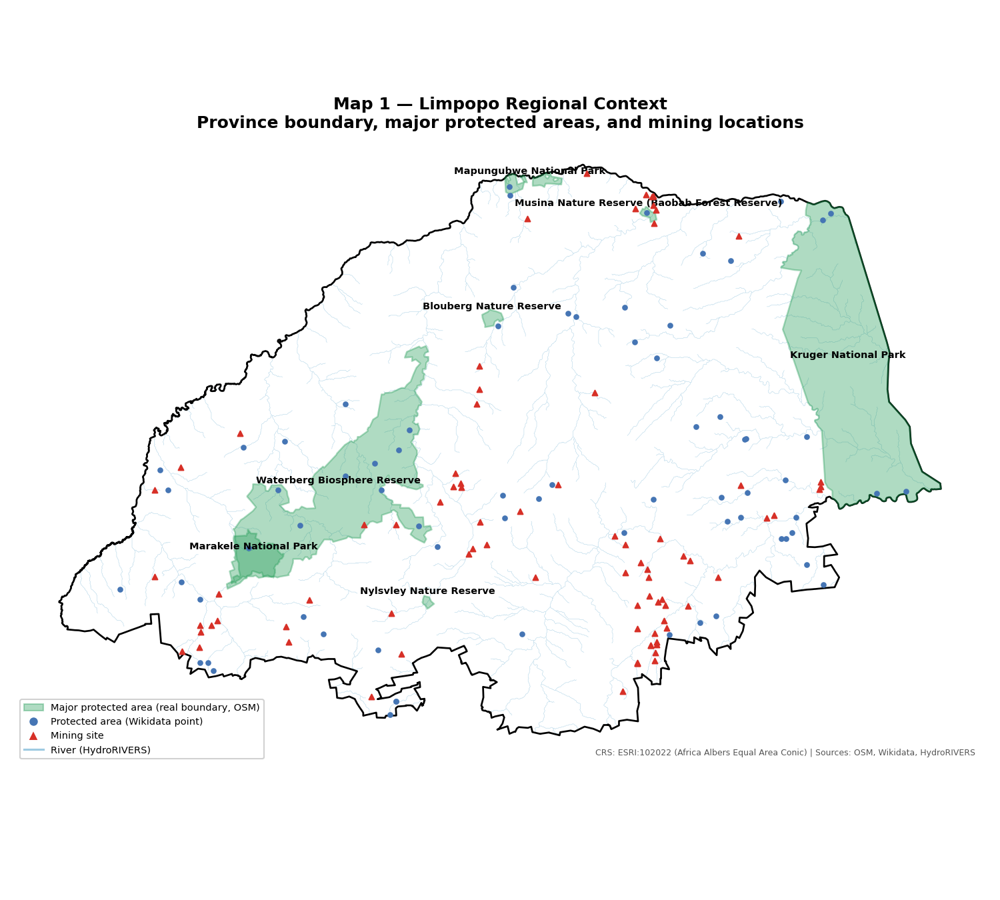
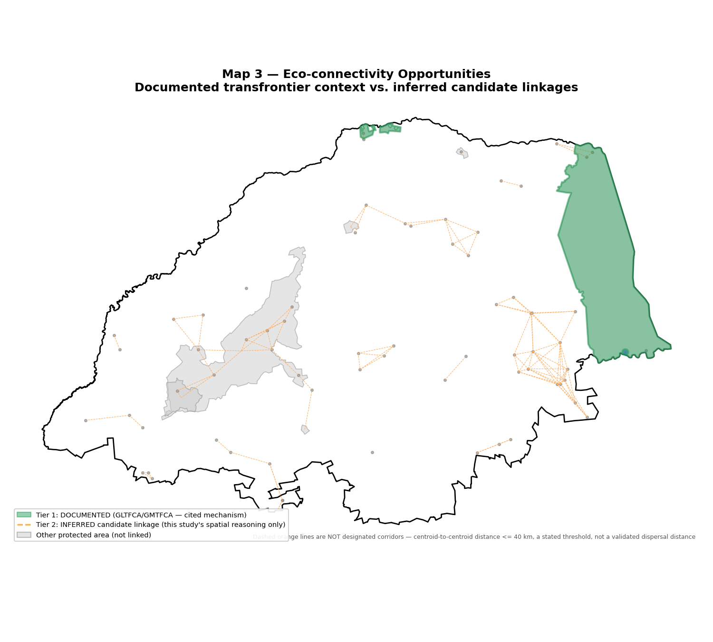
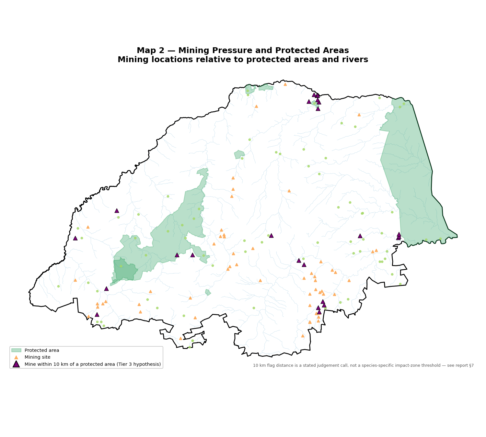
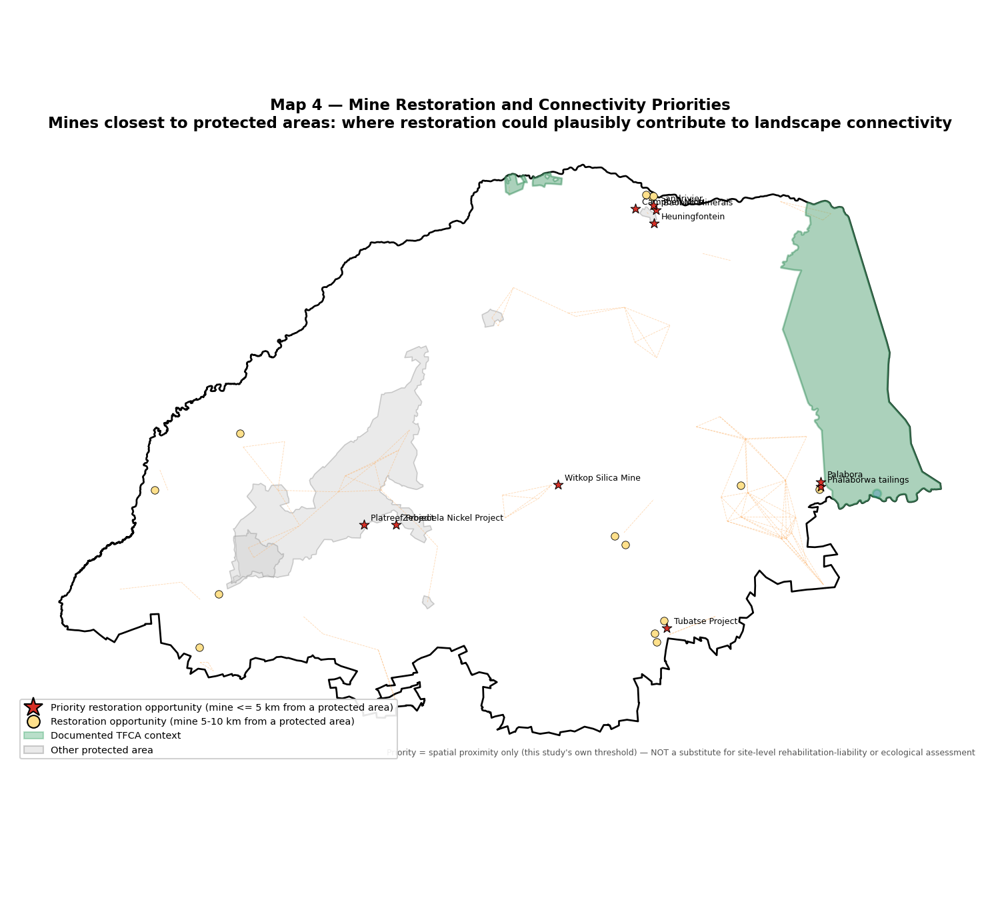

# Mine Restoration and Ecological Connectivity in Limpopo Province: A Geospatial Field Note and Regional Assessment

Linda Angulo Lopez, compiled 25 August 2026, Rewilding Portugal, Solo Field Illustrator Project

Companion data and QGIS deliverables: `research/limpopo-mine-restoration/` (scripts, GeoPackages, `.qgz` project, four report maps). Companion desk studies already in this project: `field-trips/deskStudy/safari-upscaling-coa-valley-limpopo.md` (GLTFCA figures reused directly in section 7) and `field-trips/deskStudy/camargue-ecotourism-implications-coa-valley.md` (the nearest sibling in format).

**A note on what this document is, stated plainly before anything else.** This is not a field-visit report. No site visit for this study took place, and nothing below should be read as a current field observation. It is a present-day, remotely-derived geospatial reassessment of a landscape I once had regulatory oversight of, in a different capacity, two and a half decades ago. Every claim below is labelled Sourced (from a named, cited dataset), Derived (computed by this project's own scripts from sourced data) or Inferred (this study's own spatial reasoning, stated as such and never as an established fact). There is no Observed category in this document, because there was no observation.

---

## 1. Executive summary

Between 1997 and 2002 I served as Environmental Deputy Director at South Africa's Department of Forestry, Fisheries and the Environment, where I led post-mining land restoration programmes and integrated water-catchment management at a regional scale, hands-on regulatory and field work, not desk research. Limpopo Province was part of that portfolio. I later completed a Mastère Spécialisé en Administration des Mines at Mines Paris-PSL (2001), and I now work as a landscape-connectivity researcher on Rewilding Portugal's Côa Valley programme. This study turns that current toolkit, resistance-surface thinking, spatial data acquisition, evidence-tiered corridor reasoning, back onto the province where my restoration career started.

I assembled two structured datasets from scratch for this study: 81 mining-related records and 78 protected/conservation-area records across Limpopo Province, both built from Wikidata (cross-checked against OpenStreetMap boundary polygons and, for named major sites, independent press/company sources), because South Africa's two live official datasets, DFFE's SAPAD protected-area database and DMRE's SAMRAD mining cadastre, were not reachable for this study (section 4 explains why, in detail, not as a footnote).

The headline spatial finding: Palabora copper mine and the associated Phalaborwa tailings sit 3.0 and 3.8 kilometres from Kruger National Park's boundary respectively, inside a province where mining and the country's flagship transfrontier conservation network share the same landscape at a genuinely small scale. Two documented transfrontier mechanisms already stitch Limpopo's protected areas into cross-border networks, the Great Limpopo Transfrontier Park (Kruger plus Mozambique's Limpopo National Park plus Zimbabwe's Gonarezhou, fences removed since 2003) and the Greater Mapungubwe Transfrontier Conservation Area (Mapungubwe plus Botswana's Northern Tuli Game Reserve plus Zimbabwe's Tuli Circle Safari Area). Beyond those two documented mechanisms, I identified 115 pairs of protected areas close enough to each other (under 40 km centroid-to-centroid, a stated threshold, not a validated dispersal distance) to flag as candidate linkages worth field investigation, and 24 mining sites within 10 km of a protected area boundary, 10 of them within 5 km, which I treat as the province's clearest restoration-to-connectivity opportunities.

None of this is a corridor-design study. It is a regional screening exercise, built to tell a restoration planner where to look first.

## 2. Background and restoration context

I want to state my actual role precisely, because precision here matters more than colour. From 1997 to 2002 I held the title of Environmental Deputy Director at what is now South Africa's Department of Forestry, Fisheries and the Environment. My portfolio covered post-mining land restoration, applying functional ecology to degraded mine land, and integrated water-catchment management and environmental governance, at a regional scale. This was regulatory and field work, not a desk posting. I do not have, in any verified record I hold, a list of the specific mines I worked on, the exact sites I visited, or dated field measurements from that period, so I am not going to invent them here. What I can say honestly is that Limpopo Province, the country's most mineral-intensive province outside the North West platinum belt, sat within that regional mandate.

In 2001 I completed a Mastère Spécialisé en Administration des Mines at Mines Paris-PSL, a mining-administration qualification that sits alongside the restoration-ecology side of that role rather than instead of it. Since February 2026 I have worked as a researcher on Rewilding Portugal's Rewilding Academic Talent Programme, building resistance-surface and multispecies corridor models for the Côa Valley (see `research/eco-connectivity/` in this same repository). That is where the method in this document comes from: I am applying a current landscape-connectivity toolkit to a province I once regulated, not recreating a memory of it.

Why does this matter for restoration planning specifically? Because post-mining rehabilitation decisions, in my regulatory experience and in the broader literature, are made site by site far more often than they are made with reference to the surrounding landscape's conservation value. A rehabilitation plan can meet every closure-permit requirement for the mine footprint itself and still miss the fact that the site sits three kilometres from a national park boundary. This study exists to put that landscape context back into view before restoration planning starts, not after.

## 3. Study area

Limpopo Province, South Africa's northernmost province, bordering Botswana, Zimbabwe and Mozambique. Its published area is 125,755 km² (10.4% of South Africa's national area, confirmed via web search, 25 August 2026). This study's own computed figure, from the OpenStreetMap boundary polygon used throughout (relation 349547), is 125,753 km², a 0.002% difference, which I treat as confirmation that the boundary source is accurate rather than as a discrepancy worth investigating further.

The province holds most of the eastern flank of South Africa's Bushveld Igneous Complex, the world's largest known platinum-group-metal deposit, alongside the Musina copper belt near the Zimbabwe border, the Waterberg coalfield, and, further south, iron ore and other Bushveld-associated commodities. It also holds Kruger National Park's northern half, Mapungubwe National Park at the Limpopo-Shashe confluence, Marakele National Park in the Waterberg, and a dense scatter of smaller provincial nature reserves and private game reserves. That juxtaposition, a major PGM mining belt and a UNESCO-listed transfrontier conservation network inside one province, is the reason this study exists.



*Map 1, regional context. Full symbology and methodology in section 10.*

## 4. Data sources and methods

### 4.1 What I tried to reach, and what actually worked

I checked reachability directly before committing to a data pipeline, rather than assuming. Two results mattered most:

(i) `egis.environment.gov.za`, which hosts DFFE's official South African Protected and Conservation Areas Database (SAPAD/PACA), returned a connection failure (`curl` gave HTTP 000) from this working environment. I could not download it.

(ii) `dmr.gov.za`, home to DMRE's SAMRAD mining cadastre, also failed to connect, and independent reporting (Miningmx, Discovery Alert) confirms that DMRE itself disabled SAMRAD's public GIS viewer after launch, with its announced replacement not yet public as of the most recent coverage I found. There is currently no live, publicly reachable, official South African mining-cadastre GIS source, independent of whether my own connection to it works.

I also checked SANBI's Biodiversity GIS portal (`bgis.sanbi.org`, reachable, but SAPAD is not directly linked from its homepage and would need further portal navigation, likely registration) and the Protected Planet/WDPA API (`api.protectedplanet.net`, reachable, but returns HTTP 401 without a personal API token, which requires an email signup I cannot complete on Linda's behalf without her doing it herself).

What did work: the Wikidata SPARQL endpoint and OpenStreetMap's Nominatim and Overpass services, both confirmed reachable and both returning real, checkable records. I built this study's pipeline on those two, with a documented manual upgrade path to SAPAD for anyone who can reach it (section 13).

### 4.2 Query design, including a mistake worth keeping visible

My first SPARQL attempt used an unbounded transitive property path, `?item wdt:P131* wd:Q134907`, to find everything administratively inside Limpopo. It timed out after 40 seconds. The working alternative uses Wikidata's `wikibase:box` geo-service for a bounding-box pull, which is fast but deliberately over-inclusive, it also returns real North West Province platinum-belt mines near Rustenburg (Bafokeng, Crocodile River, Eland) and Mpumalanga's Sabi Sands Game Reserve. Every bounding-box pull in this study is clipped afterward against the real Limpopo boundary polygon (`geopandas.clip`), which removes that leakage.

A second problem surfaced during testing: a single SPARQL query joining core fields with `OPTIONAL` commodity, type and area clauses multiplies result rows for every combination, and a fixed `LIMIT` on that multiplied result silently dropped Kruger National Park from an early protected-area test pull, even though Kruger is present in the underlying data. The scripts in `research/limpopo-mine-restoration/scripts/` avoid this by running small, focused, `DISTINCT` queries per attribute and joining them in pandas, and by individually verifying that named must-include sites (Kruger, Mapungubwe, Marakele, Mogalakwena, Venetia, Palabora, Grootegeluk, and, separately, Thabazimbi) actually appear in the final output rather than trusting a generic pull.

### 4.3 Coordinate reference system

Acquisition and display use EPSG:4326 (matching OSM and Wikidata's native format). All distance, area and buffer computation uses ESRI:102022, Africa Albers Equal Area Conic, the continental-Africa equal-area projection, verified resolvable via `pyproj` before use. This plays the same role in this study that EPSG:3035 (ETRS89-LAEA Europe) plays in the Côa Valley pipeline's own `CRS_METRIC`. I did not use a UTM zone: Limpopo straddles UTM 35S and 36S, and a single UTM zone would distort accuracy on the province's eastern edge, precisely where Kruger and Mapungubwe sit and where this study's most important distance measurements are taken.

### 4.4 Rivers

`data-management/data/raw/colab/hydrorivers_100.gpkg`, already staged locally for the Côa Valley pipeline's own catchment tracing, turned out on inspection (`fiona` bounds check) to be a global HydroRIVERS extract, not a Europe-only one as I initially assumed before checking. I read it with a bounding-box filter, per this project's own established rule never to load 2.6 million features unfiltered, then clipped to the province boundary: 3,807 segments in the discovery bounding box, 2,483 after the real clip. This extract carries no river-name field, only Strahler stream-order and discharge attributes (`ORD_STRA`, `DIS_AV_CMS`, and related columns), so the rivers layer in the maps below is symbolised by stream order rather than labelled by name. The Limpopo River's own mainstem is identifiable as the highest-order line tracing the province's northern border, without the dataset stating that name explicitly.

## 5. Mining landscape

Eighty-one mining-related records, Sourced primarily from Wikidata's bounding-box pull, clipped to the province boundary, with five named major sites individually verified: Mogalakwena (platinum group metals, Anglo American), Venetia Diamond Mine (De Beers), Palabora (copper), Grootegeluk Coal Mine (Exxaro), and Thabazimbi Iron Ore Mine, which has no dedicated Wikidata item at all and had to be added from press sources instead (Mining Review, Miningmx, Anglo American Kumba's own release), with its coordinates proxied from the Thabazimbi town record since no mine-specific point exists anywhere I checked.

The province's dominant commodity signature, unsurprisingly, is platinum-group metals: 25 records list the combination gold, palladium, platinum (plus a fifth element I address below), and a further 5 list that same set with chromium added, tracing the eastern limb of the Bushveld Complex through the Steelpoort and Burgersfort area. Chromium, iron ore, nickel, coal, copper, diamond and uranium each appear as standalone or secondary commodities at named sites.

**A data-quality flag I want to state clearly, not bury in a footnote.** Thirty-one of the 81 records list "rubidium" (Wikidata Q895) as a mined commodity, always alongside gold, palladium and platinum. Rubidium is not a documented Bushveld Complex product in any geological source I checked, the real platinum-group by-product suite is platinum, palladium, rhodium (Q1087, a completely different Wikidata identifier, not a near-miss typo of Q895), plus nickel and copper. This reads as a genuine upstream error in whatever process populated these Wikidata records, most likely a rhodium/rubidium name confusion, not a real regional commodity, and I am flagging it rather than repeating it as fact. One further record, "Phalaborwa tailings," lists "periodic table" as its commodity, which is plainly not a usable value either. Both anomalies are preserved in the `data_quality_flag` field of `limpopo_mining_sites.gpkg` and the accompanying CSV, not silently corrected, so the next person to use this data can see exactly what Wikidata said and judge for themselves.

Status information is thin. Wikidata's dissolution/end-date property (P576) is populated for none of the bbox-pulled records, so 80 of the 81 records carry "not stated in source" rather than an assumed "active." The one exception is Thabazimbi, whose September 2016 closure is well documented in secondary press coverage rather than in Wikidata itself.

**Selected records** (full 81-row table in `research/limpopo-mine-restoration/output/tables/mining_sites.csv`):

| Name | Commodity | Status | Confidence note |
|---|---|---|---|
| Mogalakwena | gold; palladium; platinum; [rubidium flagged] | not stated | Wikidata P625, bbox pull |
| Venetia Diamond Mine | diamond | not stated | Wikidata P625, bbox pull |
| Palabora | copper; gold; palladium; platinum; [rubidium flagged] | not stated | Wikidata P625, bbox pull |
| Grootegeluk Coal Mine | lignite; metallurgical coal | not stated | Wikidata P625, bbox pull |
| Thabazimbi Iron Ore Mine | iron ore | closed/ended 2016-09-01 | Town-level coordinate proxy, no mine-specific point exists |
| Messina Mine | copper | not stated | Wikidata P625, bbox pull |
| Vele coal mine | coal | not stated | Wikidata P625, bbox pull |
| Springbok Flats mine | uranium; uranium ore | not stated | Wikidata P625, bbox pull |
| Eersteling Gold Mine | gold | not stated | Wikidata P625, bbox pull |
| Phalaborwa tailings | [periodic table - unusable value] | not stated | Wikidata data-quality issue, flagged not corrected |

## 6. Protected areas and conservation landscape

Seventy-eight protected-area records. Seven carry a real OpenStreetMap boundary polygon rather than a Wikidata point, fetched individually because these are the sites the analysis and the maps depend on most: Kruger National Park, Mapungubwe National Park, Marakele National Park, Blouberg Nature Reserve, Nylsvley Nature Reserve, Musina Nature Reserve (Baobab Forest Reserve), and Waterberg Biosphere Reserve.

I cross-checked the three SANParks flagship figures against their published national totals, and I want to report all three results honestly, including where they disagree. Marakele's computed area, 66,984 ha, matches SANParks' published 67,000 ha almost exactly (99.98%). Kruger's Limpopo-only computed area, 986,584 ha, is 50.3% of SANParks' published national total of 1,962,300 ha, consistent with the park's well-known east-west split across the Limpopo/Mpumalanga provincial boundary, not a data error. Mapungubwe's computed area, 19,819 ha, comes to only 70.8% of SANParks' published 28,000 ha, a real gap I have not resolved in this pass, possibly reflecting contractual or private-land additions the OSM boundary doesn't capture, possibly an OSM completeness gap. I am stating both figures rather than picking one.

Beyond the three named parks, the bounding-box pull surfaced several sites worth naming individually because of what they mean for a restoration-and-connectivity study specifically. Venetia Limpopo Nature Reserve is De Beers' own conservation land around the Venetia diamond mine, a rare case in this dataset of a mining company's land already functioning as a protected area rather than sitting adjacent to one. Makuleke is a land-restitution community-conservation area inside Kruger's northern section, returned to the Makuleke community under South Africa's land-restitution programme while remaining under conservation management, a governance model with real relevance to any restoration planning that touches land tenure and community rights in this province. Two further UNESCO Biosphere Reserve designations beyond Waterberg appeared in the pull: Vhembe Biosphere Reserve (covering the Soutpansberg and Mapungubwe area) and Kruger to Canyons Biosphere Reserve, neither of which I had set out to find, both of which strengthen the case, developed further in section 7, that Limpopo already carries more international conservation-designation infrastructure than a first glance at the province suggests.

**Selected records** (full 78-row table in `research/limpopo-mine-restoration/output/tables/protected_areas.csv`):

| Name | Designation | Boundary source | Computed area (ha) | Published comparison |
|---|---|---|---|---|
| Kruger National Park | National Park | OSM polygon, clipped to Limpopo | 986,584 | 50.3% of 1,962,300 ha national total (SANParks) |
| Mapungubwe National Park | National Park | OSM polygon | 19,819 | 70.8% of 28,000 ha (SANParks) - unresolved gap |
| Marakele National Park | National Park | OSM polygon | 66,984 | 99.98% of 67,000 ha (SANParks) |
| Waterberg Biosphere Reserve | UNESCO Biosphere Reserve | OSM polygon | 662,366 | Not independently verified against unesco.org in this pass |
| Musina Nature Reserve (Baobab Forest Reserve) | Provincial Nature Reserve | OSM polygon | 4,976 | Not independently verified |
| Blouberg Nature Reserve | Provincial Nature Reserve | OSM polygon | 9,375 | Not independently verified |
| Nylsvley Nature Reserve | Provincial Nature Reserve / Ramsar wetland | OSM polygon | 3,387 | Not independently verified |
| Venetia Limpopo Nature Reserve | Nature Reserve (private, De Beers) | Wikidata point | not computed (point only) | - |
| Makuleke | Community conservation area (land restitution) | Wikidata point | not computed (point only) | - |
| Vhembe Biosphere Reserve | UNESCO Biosphere Reserve | Wikidata point | not computed (point only) | - |
| Kruger to Canyons Biosphere Reserve | UNESCO Biosphere Reserve | Wikidata point | not computed (point only) | - |

## 7. Eco-connectivity assessment

I want to be explicit about the three evidence tiers this section uses, because the task this study was set explicitly warns against blurring them, and I think that warning is correct.

**Tier 1, documented.** Two transfrontier mechanisms already connect Limpopo's protected areas across international borders, and I am citing them, not deriving them. The Great Limpopo Transfrontier Park (Kruger, South Africa, plus Limpopo National Park, Mozambique, plus Gonarezhou, Zimbabwe) removed its internal veterinary fences starting in 2003. Figures I already verified in `safari-upscaling-coa-valley-limpopo.md`: roughly 10 million hectares for the full Greater Limpopo Transfrontier Conservation Area, 3.7 million hectares for the fenced-core park itself. The Greater Mapungubwe Transfrontier Conservation Area (Mapungubwe, South Africa, plus Northern Tuli Game Reserve, Botswana, plus Tuli Circle Safari Area, Zimbabwe) runs on the same fence-removal model at the Limpopo-Shashe confluence. Source figures for GMTFCA's total area disagree, 4,872 km² per the TFCA Portal against 5,909 km² per the Peace Parks Foundation, and I am stating both rather than resolving a discrepancy I have no basis to adjudicate.

**Tier 2, inferred.** Beyond the two documented mechanisms, I computed centroid-to-centroid distances between every pair of this study's 75 non-TFCA protected areas and flagged 115 pairs under 40 km as candidate linkages. That 40 km threshold is my own judgement call, stated as exactly that, not derived from any species-specific home-range or dispersal-distance literature, because doing so properly would require naming a focal species and building the kind of resistance-surface model this study explicitly does not attempt (section 13). These 115 pairs are not corridors. They are a screening output, places where two protected areas happen to sit close enough to each other that a real connectivity study, of the kind the Côa Valley pipeline runs, would be worth commissioning.

**Tier 3, hypothesis.** Twenty-four mines sit within 10 km of a protected area's boundary or centroid, of which 10 sit within 5 km. I flag these as potential pinch points requiring field verification, not as an established finding that mining is fragmenting connectivity at these locations, proximity alone does not establish an ecological effect, and I have no vegetation, road-density or animal-movement data in this study to test that effect. The clearest case by distance is Palabora copper mine, 3.0 km from Kruger National Park's boundary, with the associated Phalaborwa tailings site 3.8 km away, both sitting against Kruger's western edge near the town of Phalaborwa, a genuinely small separation between an active PGM/copper mining operation and the fenced core of South Africa's flagship transfrontier park.

One further nuance worth stating plainly rather than glossing over: the Platreef Project mine returned a computed distance of 0.0 km from Waterberg Biosphere Reserve, meaning the mine point falls inside that reserve's polygon. This is less alarming than it sounds. UNESCO Biosphere Reserves are explicitly zoned into a protected core, a buffer, and a transition zone that permits sustainable human land use, including, in principle, mining, so a mine inside a biosphere reserve's outer boundary is not automatically a conflict in the way a mine inside a national park's fence line would be. I have not determined which zone Platreef sits in, and I am not treating this as a finding either way.



*Map 3, eco-connectivity opportunities. Solid green: Tier 1 documented (GLTFCA/GMTFCA). Dashed orange: Tier 2 inferred, not a designated corridor. Full methodology in section 10.*



*Map 2, mining pressure and protected areas, with Tier 3 hypothesis pinch points (magenta) marked. Full methodology in section 10.*

## 8. Implications for mine restoration

Three things follow directly from sections 5 through 7, read together with the restoration mandate described in section 2.

(i) Rehabilitation planning for any of the ten priority sites identified in section 9 should treat landscape connectivity as a design input, not an afterthought bolted onto a closure permit after the fact. A rehabilitation plan for Palabora or Phalaborwa that restores vegetation cover without considering movement corridors toward Kruger's boundary is solving half the problem.

(ii) The rubidium/rhodium data-quality issue in section 5 is not a minor footnote for a restoration planner. If a site's actual by-product mineralogy differs from what's recorded in the public data anyone would use to scope a rehabilitation programme, that gap needs closing with primary geological data before restoration chemistry decisions get made, not worked around with public-data assumptions.

(iii) Makuleke's land-restitution governance model, described in section 6, is a live example of restoration and land-tenure justice intersecting inside this same province. Any restoration programme operating near a similarly contested land-tenure history should treat that history as part of the restoration brief, not as a separate legal matter to be handled elsewhere. I raise this from the Global South perspective my own career has been shaped by, not as an abstract governance point: who holds the land after rehabilitation is not a footnote to the restoration question, it is the restoration question, in a province where land restitution is an active, ongoing process.

## 9. Priority restoration/connectivity opportunities

Ten mines fall within 5 km of a protected area boundary or centroid, the tightest band this study defines, and I treat these as the priority list:

| Mine | Nearest protected area | Distance (km) |
|---|---|---|
| Platreef Project | Waterberg Biosphere Reserve | 0.0 (inside boundary) |
| Heuningfontein | Musina Nature Reserve | 1.5 |
| Baobab Minerals | Musina Nature Reserve | 2.3 |
| Palabora | Kruger National Park | 3.0 |
| Sandrivier | Musina Nature Reserve | 3.5 |
| Zebediela Nickel Project | Waterberg Biosphere Reserve | 3.7 |
| Phalaborwa tailings | Kruger National Park | 3.8 |
| Witkop Silica Mine | Polokwane Game Reserve | 3.9 |
| Campbell Mine | Musina Nature Reserve | 4.0 |
| Tubatse Project | Berghoek Natuurreserwe | 4.3 |

A further fourteen sites fall in the 5-10 km secondary band (full list in `mine_pinch_points` layer, `limpopo_connectivity.gpkg`). Two geographic clusters stand out: the Musina cluster, five sites within 8 km of Musina Nature Reserve near the Zimbabwe border, sitting inside the broader Vhembe Biosphere Reserve and adjacent to the Mapungubwe/GMTFCA landscape, and the Phalaborwa cluster, Palabora and its tailings facility against Kruger's western boundary. I would prioritise field verification at the Phalaborwa cluster first, given its direct adjacency to a documented Tier 1 transfrontier mechanism rather than an inferred Tier 2 or 3 relationship.



*Map 4, mine restoration and connectivity priorities. Red stars: priority sites (<= 5 km). Yellow circles: secondary opportunities (5-10 km). Full methodology in section 10.*

## 10. QGIS mapping methodology

All four maps share a base: `research/limpopo-mine-restoration/qgis/limpopo_mine_restoration.qgz`, built with PyQGIS (system Python 3, not the `coa` conda environment, per this project's existing split), CRS ESRI:102022 throughout, sourced from the GeoPackages in `data/processed/`. The static PNGs referenced below (`output/maps/`) were generated with matplotlib and GeoPandas, following this project's existing convention for report-embedded maps (`research/eco-connectivity/scripts/generate_maps.py`), not QGIS print layouts.

**Map 1, regional context** (`01_regional_context.png`). Layers: province boundary (black outline), rivers (light blue, Strahler-order line width), protected areas (green fill for the 7 OSM-polygon sites, blue points for the remaining 71 Wikidata-point sites), mining sites (red triangles). Labels on the seven named major protected areas only, to avoid a labelling collision the 78-record full set would create. Scale: unset (province-wide extent, no fixed print scale specified, distances readable from the CRS's equal-area properties). Assumption: point-only protected-area records are shown as points regardless of the reserve's true extent, likely understating the visual footprint of some larger unmapped reserves. Limitation: the 71 point-only records carry no boundary information at all, only a coordinate.

**Map 2, mining pressure and protected areas** (`02_mining_pressure.png`). Adds the Tier 3 pinch-point layer (magenta triangles, mines within 10 km of a protected area) over the same base. Processing: computed via `build_connectivity_analysis.py`'s nearest-distance join between mines and the combined protected-area layer (both polygon and point records), in ESRI:102022. Assumption: distance to a point-only protected-area record is measured to that single coordinate, not to a true boundary, likely overstating true separation for large reserves recorded only as points.

**Map 3, eco-connectivity opportunities** (`03_connectivity_opportunities.png`). Documented Tier 1 sites (solid green fill, Kruger and Mapungubwe) versus Tier 2 inferred linkages (dashed orange lines, the 115 candidate pairs). Deliberate symbology choice: a dashed line for Tier 2 and a solid fill for Tier 1, so the distinction survives a black-and-white print, not just a colour legend. Assumption: the 40 km threshold and centroid-to-centroid measurement are both stated simplifications, not a species-calibrated least-cost-path result.

**Map 4, mine restoration and connectivity priorities** (`04_restoration_priorities.png`). Ten priority mines (red stars, within 5 km) and fourteen secondary opportunities (yellow circles, 5-10 km) over the Tier 1/Tier 2 connectivity base. Processing: a second, tighter distance cut applied to the same Tier 3 pinch-point layer already computed for Map 2. Limitation stated directly on the map's own footer text: priority here means spatial proximity only, not a substitute for site-level rehabilitation-liability or ecological assessment.

## 11. Field verification priorities

Everything in this document is remotely derived. Before any of it informs an actual restoration decision, I would prioritise field verification in this order: (i) the ten priority sites in section 9, starting with Phalaborwa/Palabora given its documented-corridor adjacency, to confirm the mine's actual current footprint, operational status and rehabilitation-liability position against what public data shows; (ii) the Mapungubwe area discrepancy in section 6, checking the OSM boundary against SANParks' own published boundary or a site visit; (iii) the rubidium/rhodium commodity flag in section 5, checking primary geological reporting (a mine's own annual report or an NI 43-101/SAMREC-equivalent competent-persons report) for the sites most affected; (iv) ground-truthing at least one of the 115 Tier 2 candidate linkages, to establish whether the underlying land cover between two flagged protected areas is actually traversable by wildlife or whether it's already fully converted to agriculture, settlement or fenced private land, which this desk study has no way to determine.

## 12. Recommendations

(i) Treat this study's GeoPackages and QGIS project as a screening tool, not a planning-grade dataset, use it to decide where to send a field team, not to write a rehabilitation plan directly from it.

(ii) Pursue the SAPAD/BGIS manual download path described in section 13 before any planning-grade use of the protected-area layer, the current dataset's Wikidata/OSM foundation is good enough for screening and genuinely surprised me with how much it surfaced (Makuleke, Venetia Limpopo Nature Reserve, two additional Biosphere Reserves I hadn't set out to find), but it is not the authoritative government source.

(iii) Flag the rubidium/rhodium data-quality issue back to Wikidata itself, correcting it at the source benefits every future user of this data, not just this study.

(iv) Commission a proper resistance-surface connectivity model, of the kind already running for the Côa Valley in `research/eco-connectivity/`, for the Phalaborwa cluster specifically, given its Tier 1 adjacency, before this study's Tier 2/3 screening gets treated as more than it is.

## 13. Limitations

I am listing these directly rather than folding them into a closing paragraph, because several of them materially bound what this study can claim.

(i) South Africa's two official live GIS sources, SAPAD (protected areas, DFFE/EGIS) and SAMRAD (mining cadastre, DMRE), were not usable for this study. SAPAD failed to connect from this working environment (`curl` returned HTTP 000 from `egis.environment.gov.za`); anyone who can reach that host directly should download the current SAPAD shapefile release (quarterly, non-commercial use permitted per the portal's own terms) and substitute it for the OSM-polygon protected-area records here. SAMRAD's public GIS viewer has been disabled by DMRE itself since shortly after launch, with a replacement not yet public as of the sources checked, so no manual workaround exists for the mining side at all right now.

(ii) This is not a resistance-surface or least-cost-path connectivity model. The Côa Valley pipeline this project also maintains uses Omniscape circuit-theory modelling over calibrated suitability rasters built for named focal species. This study has no land-cover, road-density or animal-movement data, and its Tier 2/3 findings are distance-based screening, explicitly not a substitute for that kind of model.

(iii) The 40 km (Tier 2 linkage) and 10 km/5 km (Tier 3 pinch-point) thresholds are stated judgement calls, not derived from any species-specific literature. A different, defensible threshold would produce a different candidate list.

(iv) HydroRIVERS carries no river-name attribute in the extract used here, so the rivers layer is symbolised by stream order, not labelled.

(v) The rubidium/periodic-table Wikidata data-quality issues (section 5) affect roughly 38% of the mining dataset's commodity field and are flagged, not corrected.

(vi) Mapungubwe National Park's computed area (19,819 ha) is 70.8% of SANParks' published figure (28,000 ha), unresolved in this pass.

(vii) Seventy-one of 78 protected-area records and all but five of the mining records carry point coordinates only, not boundary polygons, which means every distance measurement to those records is a coordinate-to-coordinate or coordinate-to-polygon distance, not a true edge-to-edge measurement.

## 14. Conclusion

Twenty-five years after my own restoration work began in this province, in a different role and with a different toolkit, the landscape this study surfaces is one where a major transfrontier conservation network and an active platinum, copper and iron-ore mining belt sit close enough to share boundaries in places, not close enough by coincidence, but close enough that restoration planning and connectivity planning are, in practice, the same planning question at several specific sites. The data gaps documented in section 13 are real and should be closed before this study's findings inform an actual decision. What should a restoration programme operating at Phalaborwa, three kilometres from Kruger's own boundary, be doing differently because of that proximity, and who gets to decide?

## 15. References

### Wikidata (primary source, mining and protected areas)
- [Wikidata Query Service](https://query.wikidata.org/) - SPARQL endpoint, all queries in Appendix A
- [Mogalakwena - Wikidata (Q137925153)](https://www.wikidata.org/wiki/Q137925153)
- [Limpopo - Wikidata (Q134907)](https://www.wikidata.org/wiki/Q134907)
- [mine - Wikidata (Q820477)](https://www.wikidata.org/wiki/Q820477)
- [protected area - Wikidata (Q473972)](https://www.wikidata.org/wiki/Q473972)

### OpenStreetMap (protected-area and province boundary polygons)
- [Nominatim](https://nominatim.openstreetmap.org/) - relation/way lookups, OSM IDs listed per record in Appendix B
- Limpopo Province boundary: OSM relation 349547
- Kruger National Park: OSM relation 1752987
- Mapungubwe National Park: OSM relation 2522270
- Marakele National Park: OSM relation 2608453

### Hydrology
- HydroRIVERS (HydroSHEDS family) - local extract, `data-management/data/raw/colab/hydrorivers_100.gpkg`, confirmed global coverage via `fiona` bounds check, 25 August 2026

### South African official sources (checked, not directly usable, see section 4)
- [E-GIS data downloads - DFFE](https://egis.environment.gov.za/data_egis/data_download/current) - connection failure from this environment
- [South African Protected and Conservation Areas Database (PACA/SAPAD) - DFFE](https://egis.environment.gov.za/protected_and_conservation_areas_database) - connection failure from this environment
- [BiodiversityGIS (BGIS) - SANBI](https://bgis.sanbi.org) - reachable, SAPAD not directly linked from homepage
- [SAMRAD Online System - DMRE](https://www.dmr.gov.za/samrad-online-system) - connection failure; public GIS viewer independently confirmed disabled
- [Is the SA Govt's proposed new mining cadastre already a metaphoric cadaver? - Miningmx](https://www.miningmx.com/opinion/43951-is-the-sa-govts-proposed-new-mining-cadastre-already-a-metaphoric-cadaver/)
- [South Africa Mining Rights Cadastre System: 2026 Rollout Progress - Discovery Alert](https://discoveryalert.com.au/south-africa-mining-rights-cadastre-rollout-samrad-2026/)

### Protected-area figures and cross-checks
- [Marakele National Park - SANParks](https://www.sanparks.org/parks/marakele)
- [Mapungubwe National Park - SANParks](https://www.sanparks.org/parks/mapungubwe)
- [Kruger National Park - SANParks](https://www.sanparks.org/parks/kruger)
- [Greater Mapungubwe Transfrontier Conservation Area - TFCA Portal](https://www.tfcaportal.org/tfcas/greater-mapungubwe-transfrontier-conservation-area)
- [Mapungubwe - rising to greatness - Peace Parks Foundation](https://www.peaceparks.org/mapungubwe-rising-to-greatness/)

### Thabazimbi Iron Ore Mine (no Wikidata item, sourced independently)
- [ArcelorMittal South Africa takes over Thabazimbi mine for closure - Mining Review](https://www.miningreview.com/base-metals/arcelormittal-south-africa-takes-over-thabazimbi-mine/)
- [Kumba de-risked as transfers Thabazimbi to ArcelorMittal SA - Miningmx](https://www.miningmx.com/news/ferrous-metals/28945-kumba-de-risked-transfers-thabazimbi-arcelor-mittal-sa/)
- [Thabazimbi mine to be transferred to ArcelorMittal South Africa Ltd - Anglo American Kumba Iron Ore](https://www.angloamericankumba.com/media/press-releases/2017/09-02-2017)

### This project's own prior work (cross-referenced above)
- `field-trips/deskStudy/safari-upscaling-coa-valley-limpopo.md` - GLTFCA figures reused in section 7
- `research/eco-connectivity/` - the resistance-surface/Omniscape connectivity modelling this study explicitly does not attempt (section 13)

## 16. Appendices

### Appendix A - SPARQL queries used (verbatim)

**Mining sites, core query:**
```sparql
SELECT DISTINCT ?item ?itemLabel ?coord WHERE {
  SERVICE wikibase:box {
    ?item wdt:P625 ?coord .
    bd:serviceParam wikibase:cornerWest "Point(26.3 -25.6)"^^geo:wktLiteral .
    bd:serviceParam wikibase:cornerEast "Point(31.9 -22.0)"^^geo:wktLiteral .
  }
  ?item wdt:P31/wdt:P279* wd:Q820477 .
  SERVICE wikibase:label { bd:serviceParam wikibase:language "en". }
}
```

**Mining sites, commodity query:**
```sparql
SELECT DISTINCT ?item ?commodityLabel WHERE {
  SERVICE wikibase:box {
    ?item wdt:P625 ?coord .
    bd:serviceParam wikibase:cornerWest "Point(26.3 -25.6)"^^geo:wktLiteral .
    bd:serviceParam wikibase:cornerEast "Point(31.9 -22.0)"^^geo:wktLiteral .
  }
  ?item wdt:P31/wdt:P279* wd:Q820477 .
  ?item wdt:P1056 ?commodity .
  SERVICE wikibase:label { bd:serviceParam wikibase:language "en". }
}
```

**Protected areas, core query:**
```sparql
SELECT DISTINCT ?item ?itemLabel ?coord WHERE {
  SERVICE wikibase:box {
    ?item wdt:P625 ?coord .
    bd:serviceParam wikibase:cornerWest "Point(26.3 -25.6)"^^geo:wktLiteral .
    bd:serviceParam wikibase:cornerEast "Point(31.9 -22.0)"^^geo:wktLiteral .
  }
  ?item wdt:P31/wdt:P279* wd:Q473972 .
  SERVICE wikibase:label { bd:serviceParam wikibase:language "en". }
}
```

Full query set, including the metadata (operator/start/end date) and area queries, and the Python/GeoPandas acquisition, clipping and connectivity-analysis code: `research/limpopo-mine-restoration/scripts/acquire_mining_sites.py`, `acquire_protected_areas.py`, `acquire_rivers.py`, `build_connectivity_analysis.py`.

### Appendix B - reproduction steps

1. `conda activate coa`
2. `cd research/limpopo-mine-restoration/scripts`
3. `python3 acquire_limpopo_boundary.py`
4. `python3 acquire_mining_sites.py`
5. `python3 acquire_protected_areas.py`
6. `python3 acquire_rivers.py`
7. `python3 build_connectivity_analysis.py`
8. `python3 generate_maps.py` (matplotlib PNGs, `coa` env)
9. System `python3 build_qgis_project.py` (PyQGIS, system interpreter, not the `coa` env)

### Appendix C - full record counts

- Mining sites: 81 (76 from the Wikidata bounding-box pull plus boundary clip, 4 individually verified named mines, 1 Thabazimbi added from press sources with a town-level coordinate proxy)
- Protected areas: 78 (71 Wikidata point records plus boundary clip, 7 real OSM boundary polygons for named major sites)
- River segments: 2,483 (HydroRIVERS, clipped to province boundary, unnamed)
- Tier 1 documented TFCA context: 3 protected-area records (Kruger National Park, Greater Kruger National Park, Mapungubwe National Park)
- Tier 2 inferred candidate linkages: 115 protected-area pairs
- Tier 3 hypothesis mine pinch points: 24 (10 within 5 km, 14 within 5-10 km)

Full per-record tables: `research/limpopo-mine-restoration/output/tables/mining_sites.csv`, `protected_areas.csv`.
