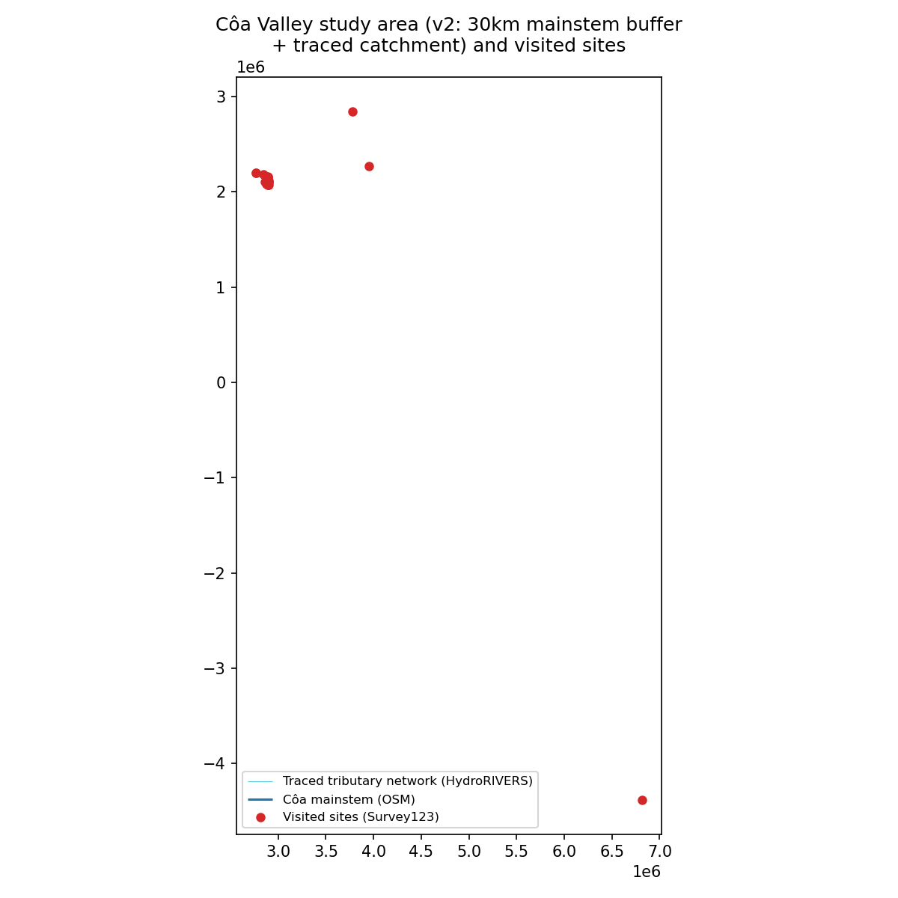
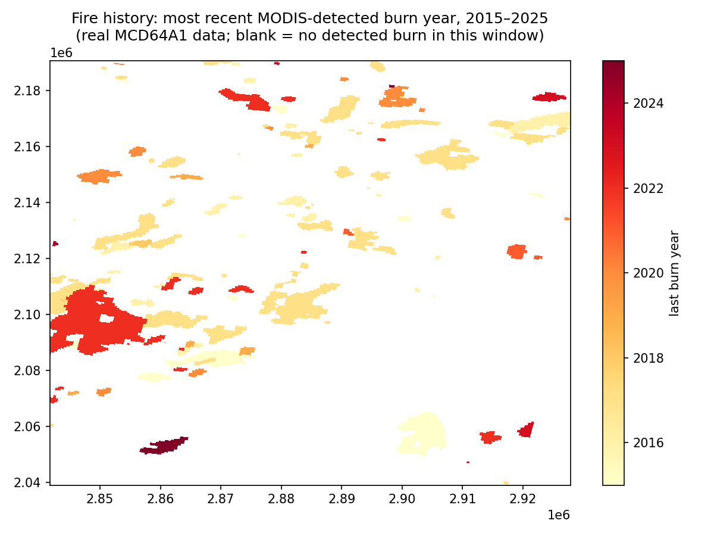
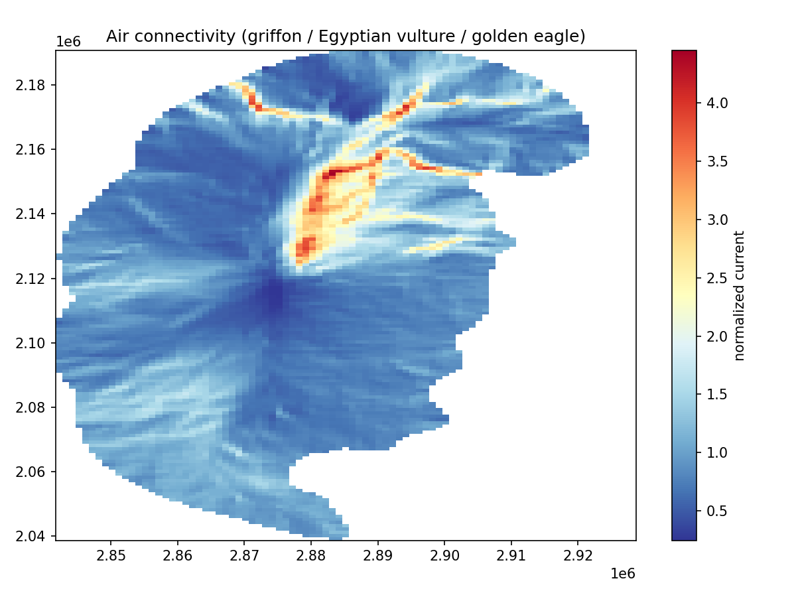
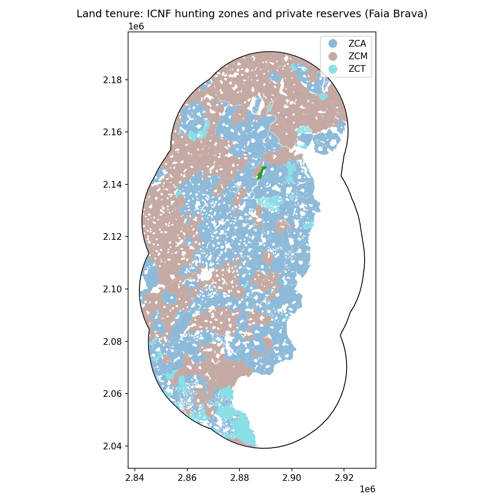

**Correspondence:** Linda Angulo Lopez, coa-connectivity-lab (GitHub). ORCID: [to add]

**Version:** preprint draft v0.1, prepared for deposit on Zenodo. Not peer reviewed.

## Abstract

Landscape connectivity models are now a standard input to rewilding and restoration planning, but the usual tools assume a Julia runtime, occurrence data of good spatial quality, and a team with time to run them. Small rewilding organisations often have none of these. We present a pure-Python circuit-theory workflow applied to the Greater Côa Valley, northern Portugal, a rewilding landscape with no published boundary polygon of its own, and pair it with a field illustration practice carried out on the same ground in August 2026. Following the multi-species framework of Prima et al. (2024), ten focal species were grouped by movement medium (land, water, air). Random Forest suitability models trained on GBIF records were converted to resistance surfaces on a 100 m grid over a 10,230 km² catchment-extended study area, and current flow was solved with a `scipy.sparse` moving-window solver. We extend the framework with three penalties drawn from local evidence: (i) a recency-weighted fire penalty from MODIS burned-area data (2015 to July 2025; 10.07% of grid cells burned at least once); (ii) a distance-decayed barrier penalty from 22 field-recorded barriers, tiered by observed permeability; and (iii) a flat penalty over two UNESCO heritage areas. A direction-of-effect check confirms the barrier penalty behaves as intended (land resistance 94.0 at fully blocking against 88.6 at easily crossable barriers; water 100.0 against 22.7). The strongest combined corridor follows the lower Côa north to the Douro. Training accuracies (0.78 to 0.99) are not validation, and we say so. The three connectivity maps were redrawn for a public gallery. The field illustrations paired with them will be published during Global Artivism Month (1 November to 10 December 2026), to test whether a model can be read, and challenged, by the people who live in the valley.

**Keywords:** landscape connectivity; circuit theory; resistance surface; rewilding; citizen science; wildfire; field illustration; science communication; Portugal; Python

## 1. Introduction

I grew up on South Africa's Wild Coast and spent five years, from 1997 to 2002, as an environmental deputy director in South Africa's national environment department, working on post-mining land restoration and catchment management after apartheid. I start there because it shapes what this paper tries to do. In that work a restoration plan was only as good as the people on the ground who could read it, argue with it, and carry it out. A model that stays on a laptop does not restore anything.

The Greater Côa Valley, in north-eastern Portugal near the Spanish border, is one of the landscapes of Rewilding Europe's network, run locally by Rewilding Portugal (founded 2019) alongside the older Faia Brava reserve managed by Associação Transumância e Natureza (ATN, founded 2000). The two are separate organisations doing closely aligned work in the same landscape, a distinction that matters wherever land tenure is discussed below. Rewilding Portugal describes its project area as roughly 318,000 ha "between the Malcata mountains and the Douro Valley", but no boundary polygon for that area is published.

Connectivity modelling asks where animals are likely to move between areas of good habitat, and where that movement is pinched or cut. Circuit theory (McRae et al., 2008) treats the landscape as an electrical circuit in which each cell has a resistance to movement, and current flow stands in for the probability that a random walker passes through a cell. The omnidirectional variant, implemented in Omniscape.jl (Landau et al., 2021), removes the need to choose source and destination patches in advance, which suits a landscape where core areas are still being built. Prima et al. (2024) combined these ideas into a four-step multi-species framework: (i) group species by how they move; (ii) model habitat suitability and convert it to resistance; (iii) solve current flow; (iv) overlay the result on protected areas.

Three practical problems stand between that framework and a small rewilding team. (i) Omniscape.jl needs a Julia installation, and the older Python `circuitscape` package no longer installs cleanly. Most conservation NGOs work in Python, R or QGIS. (ii) Prima et al. filter occurrences to under 1 km coordinate uncertainty. For the Côa, that rule removes almost every carnivore record, partly because records of sensitive species are deliberately blurred (one wolf record here sits about 28 km from its true location). (iii) The framework's resistance surfaces come from suitability alone. What a field team actually sees, a new fence, a weir, a burned hillside, has no route into the model.

This paper describes a workflow built to answer those three problems for one landscape, and a companion field illustration practice. The analysis is published as an open Jupyter notebook (v6) and data bundle; this paper is the written account of it. It is a methods and case-study paper. It does not claim a methodological advance over Circuitscape, and it does not claim that its maps show where animals are. They show where movement is likely to concentrate under stated assumptions.

We frame the work as "safe and just". That framing did not start as a scientific framework. It comes from Indigenous Science and community-led climate justice (Hernandez, 2022) and was later given a quantified academic form by the Earth Commission (Rockström et al., 2023; Gupta et al., 2023). An earlier version of this project credited the idea to a 2012 sustainability-economics model. That credit was wrong, and it has been corrected. In this paper "safe" means sensitive species locations are never shown at exact coordinates, and "just" means asking who can read, use and contest a corridor map, not only whether a corridor exists.

## 2. Study area

The study area is a 30 km buffer around the Côa river centreline (OpenStreetMap), extended to include the Côa's own tributary network traced from HydroRIVERS (Lehner and Grill, 2013) through its downstream topology (Fig. 1). The traced mouth reach has an upstream area of 2,512.6 km², close to the published Côa basin area of about 2,495 km², which suggests the trace found the right reach. The traced network is 39 reaches and 251.9 km long. Adding it grows the study area from 9,377 km² to 10,230 km² (+9.1%).

This study area is about 3.2 times larger than Rewilding Portugal's stated project area and covers a similar north-south range, from the Côa's source near Fóios in the Serra da Malcata to its confluence with the Douro at Vila Nova de Foz Côa. We use it as a documented stand-in rather than drawing a 318,000 ha boundary from a prose description.

The valley holds two cultural World Heritage properties: the Alto Douro Wine Region (24,600 ha) and the Prehistoric Rock Art Sites in the Côa Valley, whose protected core covers 568.6 ha. The rock art exists above water today because the Foz Côa dam, under construction in the early 1990s, was cancelled in 1996. The cofferdam from that construction still periodically floods rock-art panels.

All raster work uses ETRS89-LAEA Europe (EPSG:3035) at 100 m resolution. Field and GBIF data are handled in WGS84 (EPSG:4326) until reprojected.

{width=80%}

## 3. Methods

### 3.1 Workflow and software

The workflow is a set of Python scripts, one per step, driven by a single `config.py` that holds every path, species parameter and penalty weight, and run from a Jupyter notebook. Vector data are handled with GeoPandas, rasters with xarray and rioxarray, suitability models with scikit-learn (Pedregosa et al., 2011), and current flow with SciPy's sparse linear solvers (Virtanen et al., 2020). Fire data are read from Microsoft Planetary Computer through `pystac_client`. No Julia or commercial software is needed. The notebook runs by default from the shipped derived layers, with a single switch (`RUN_PIPELINE`) to re-run acquisition and modelling from raw inputs.

### 3.2 Functional groups and focal species

Ten focal species were grouped by movement medium, following Prima et al. (2024) but framed as land, water and air (Table 1). Each group's search radius is set by its widest-ranging member.

**Table 1.** Focal species, grouping and dispersal parameters, with GBIF records retained inside the study area.

| Group | Species | Dispersal (km) | GBIF records in study area |
|---|---|---|---|
| Land | Iberian wolf *Canis lupus*; European wildcat *Felis silvestris*; red deer *Cervus elaphus* | 80; 15; 30 | 42 |
| Water | Eurasian otter *Lutra lutra*; Iberian nase *Pseudochondrostoma polylepis*; calandino *Squalius alburnoides*; European pond turtle *Emys orbicularis* | 20; 10; 10; 5 | 362 |
| Air | Griffon vulture *Gyps fulvus*; Egyptian vulture *Neophron percnopterus*; golden eagle *Aquila chrysaetos* | 100; 100; 60 | 8,600 |

The European wildcat is treated as a sensitive species: any field record mentioning it is generalised to a 5 km grid cell before it reaches a figure, map or export.

Several species that Rewilding Portugal names as present are not modelled: the European beaver, the Sorraia horse and Tauros cattle (reintroduced grazers, not wild-dispersing species in the sense the framework models), and the cinereous vulture. The beaver is the clearest gap.

### 3.3 Occurrence data

Occurrences were downloaded from GBIF for each species and filtered to a coordinate uncertainty of 30 km, much looser than Prima et al.'s 1 km. This is a deliberate trade-off. A 1 km rule would leave the land group almost empty. The cost is spatial noise in the training data, which we carry into the limitations rather than hide. Even with the loose threshold, the land group keeps only 42 points inside the study area (wolf 137, wildcat 7 and red deer 733 usable records across the wider download extent).

### 3.4 Suitability and resistance

One Random Forest classifier per group was trained on presence points against 2,000 random background points. Land and water models use elevation, slope, terrain ruggedness, land cover (CLC+), distance to road and imperviousness. The air model uses topography only. Suitability was converted to resistance with Prima et al.'s (2024) negative-exponential transform (their Eq. 1) with a single shape parameter *c* = 4 per group, scaled to a 1 to 100 range.

Two simplifications against Prima et al. are stated plainly: one model per group instead of a four-algorithm ensemble, and one resistance shape and search radius per group instead of an uncertainty sweep.

### 3.5 Fire penalty (land group)

Wildfire is the most visible disturbance in the valley. Rewilding Portugal's 2025 annual review reports fires over roughly 10% of its project area that year, with a quarter of the Ermo das Águias rewilding area affected. The review gives no fire perimeters, so it is used as context only.

The first choice of data, EFFIS burnt-area perimeters, could not be used: the historical archive needs a manual request form, and the live web feature service returned a server error when queried. We used NASA's MODIS Burned Area Monthly product, MCD64A1 Collection 6.1 (Giglio et al., 2018), at 500 m, served as cloud-optimised GeoTIFFs through Planetary Computer. 124 monthly items from January 2015 were available. Ingestion stops at day 182 of 2025 (about 1 July 2025), so the summer 2025 fires and a July 2026 fire near Almeida, Sabugal and Pinhel, documented in our own field notes, are not in the layer.

For each cell, the most recent burn year was recorded. Burned cells receive a penalty added to their suitability-derived resistance, from 10 points for a burn at the start of the window to 60 points for the most recent burns, capped at 100.

### 3.6 Field-observed barrier penalty (land and water groups)

Field observations were recorded with an ArcGIS Survey123 form (`coa-connectivity-lab-survey`) during two field phases in August 2026. The export holds 26 rows: 22 real field visits and 4 desk-study reference pins with no visit date, which are excluded. Up to three barrier observations per visit give 25 barrier records. Three were excluded (two were fire or vegetation notes filed under "other", one had no barrier type), leaving 22 eligible barriers, of which 2 fall outside the study area grid (the Douro estuary and Atlantic coast day trip).

Each eligible barrier adds a distance-decayed penalty with a 500 m decay length. The peak weight depends on the permeability the observer recorded: fully blocking 70, partially crossable 30, easily crossable 5. Where barriers overlap, the worst one wins. Terrestrial barrier types (fences, walls, roads) are applied to the land group; dams, weirs and culverts to the water group; bridges to both.

The species observations from the same survey (26 records) are not used to train any model. Several carry the observer's own uncertainty, for example a possible Sorraia-phenotype horse herd, and are kept as narrative ground truth.

### 3.7 Heritage penalty (land group)

Boundaries for the Alto Douro Wine Region (24,600.0 ha, matching the published figure exactly) and the Côa rock-art core (568.6 ha) were taken from the Portuguese heritage authority's classified-property service (DGPC). Every land-grid cell inside either polygon receives a flat penalty of 90. The reasoning is that a legally protected heritage landscape is poor or unavailable matrix across its whole extent for land-use change toward conservation, not something that fades from an edge. The penalty applied to 20,740 cells (1.59% of the grid).

The air group is excluded from both the barrier and heritage penalties. Raptors are not stopped by a fence or a vineyard terrace, but heritage-zone disturbance (tourism, drone restrictions near the rock art) could matter to them. This is left open.

### 3.8 Current flow

Current flow was solved with a moving-window, omnidirectional approach in the spirit of Omniscape, implemented in pure Python (`run_omniscape.py`). Within each window, a sparse conductance graph is built from the resistance grid and solved with `scipy.sparse.linalg`. To keep the solve tractable, windows are laid out on a coarser block grid (152 × 87 blocks), with radius and block size set per group: land 80 km (209 windows), water 20 km (3,344 windows), air 100 km (144 windows). All three solves finish in under a minute on a laptop. Output is normalised current: cumulative current divided by the flow potential expected with uniform resistance, so values above 1 mark channelling and values below 1 mark impeded flow.

The three group surfaces were combined into a multispecies weighted mean and maximum, weighted by the number of species in each group (land 3, water 4, air 3).

### 3.9 Roads, waterways and land tenure

Roads and waterways were classified into four trade-off classes by crossing barrier severity with visitor access: 0 low barrier and low access, 1 conservation priority, 2 compatible access, 3 conflict. The waterway class reuses the water resistance surface for barrier severity.

Land tenure (the Faia Brava reserve from OpenStreetMap and WDPA, and 337 hunting zones from the ICNF cadastre: 194 associative, 108 municipal and 35 tourist) is mapped as context only. It is not a modelled barrier or asset, because this project has no first-hand knowledge of how any individual estate is managed.

### 3.10 Checks

Two automated checks were run (`validate_results.py`). (i) Grid alignment: every output raster shares the same grid and CRS. (ii) Direction of effect: land connectivity should be lower near roads than far from them, and resistance at field barriers recorded as fully blocking should be higher than at those recorded as easily crossable. Neither is a statistical validation. There are no telemetry or independent movement data for the study area to validate against, a gap Prima et al. (2024, p. 2396) describe as field-wide.

### 3.11 Field illustration

Field illustration was carried out in the same two phases as the survey (11 to 19 and 20 to 27 August 2026) from a base in Almeida. The practice was deliberately low-pressure: two- to four-hour excursions in the early morning or late afternoon, photographs, quick sketches and field notes, with finished illustrations made later. Three sites were prioritised because each stands for one of the three movement media: Vale Carapito (large herbivores, land), Paul de Toirões (a wetland recovering after drainage and damming, water), and the Côa gorge with the Penascosa rock art (the valley as a corridor across time, connection). The finished illustrations will be published during Global Artivism Month, 1 November to 10 December 2026, and are not reproduced in this paper.

## 4. Results

### 4.1 Fire history

MODIS records at least one burn in 131,618 cells, 10.07% of the study area grid, between January 2015 and July 2025 (Fig. 2). The largest single-month burn areas fall in 2015, 2017 and 2022, all known severe fire seasons in Portugal, which suggests the layer picks up real signal. Burned areas are scattered across the study area, with the largest single patch, burned in 2022, in the west.

Adding the fire penalty moves the land group's mean resistance only from 86.98 to 87.74 (Fig. 3). The shift is small because most burned cells were already moderately to highly resistant: the land-cover and ruggedness covariates already respond to conditions that go with fire.

{width=80%}

![**Figure 3.** Resistance added to the land surface, 0 = unaffected. Patch-shaped areas follow the fire record; small radial spots appear to be field-barrier penalties [verify: confirm which penalties this map includes].](figures/fig03_fire_resistance_effect.png){width=80%}

### 4.2 Resistance surfaces

With all penalties applied, land resistance ranges from 2.6 to 100 (mean 89.1), water from 1.6 to 100 (mean 71.2) and air from 1.0 to 70 (mean 26.4). The barrier penalty adds at least one resistance point to 739,310 land cells and 448,210 water cells.

The direction-of-effect check behaves as expected (Table 2). At field points recorded as fully blocking, land resistance averages 94.0 (n = 5) against 88.6 at easily crossable ones (n = 6). For water, the contrast is 100.0 (n = 1) against 22.7 (n = 3). The air group has no barrier observations of either tier. The sample sizes are very small, and the check shows only that the penalty points the right way, not that the weights are right.

**Table 2.** Direction-of-effect checks.

| Check | Condition A | Condition B | Expected | Result |
|---|---|---|---|---|
| Land connectivity vs. roads | near roads (< 25th pct distance): 0.986 | far from roads (> 75th pct): 1.010 | A < B | as expected |
| Land resistance at barriers | fully blocking: 94.0 (n = 5) | easily crossable: 88.6 (n = 6) | A > B | as expected |
| Water resistance at barriers | fully blocking: 100.0 (n = 1) | easily crossable: 22.7 (n = 3) | A > B | as expected |

### 4.3 Suitability models

Training accuracies were 0.99 (land, 42 presences), 0.95 (water) and 0.78 (air). These are fits to the training data, with no held-out split, and are not validation metrics. The air model's high suitability almost everywhere most likely reflects where birdwatchers record, not where raptors prefer to be.

### 4.4 Connectivity by group

**Land (wolf, wildcat, red deer).** Normalised current ranges from 0.751 to 1.891 (mean 0.998). The strongest channelling sits in the south-west of the study area, in north-east trending bands next to the largest recent burn (2022), where flow is squeezed between high-resistance ground (Fig. 4). A band of impeded flow runs north-south just west of the middle Côa. Elsewhere, including the lower Côa, land flow is diffuse, with short channelled segments rather than one corridor. [verify: this reading of the channelling next to the 2022 burn]

**Water (otter, native fish, pond turtle).** Normalised current ranges from 0.594 to 3.817 (mean 0.984), the widest range of the three groups, as expected from the shortest search radius (Fig. 5). Flow is most strongly channelled at the northern end, where several narrow corridors converge towards the Douro, and in east-west bands crossing the middle and upper Côa. The traced tributary catchment means flow now runs into Côa tributaries beyond the old 30 km band rather than stopping at a hard edge. The resistance still has no direct hydrology covariate.

**Air (griffon vulture, Egyptian vulture, golden eagle).** Normalised current ranges from 0.246 to 4.454 (mean 1.044), driven by topography alone (Fig. 6). No raptor from this group was confirmed in the field survey.

{width=55%}

{width=55%}

{width=80%}

### 4.5 Multispecies connectivity

The weighted multispecies mean ranges from 0.676 to 2.508 (mean 1.006), and the maximum from 0.854 to 4.454 (mean 1.222). The strongest combined corridor follows the lower Côa north to the Douro (Fig. 7), through the part of the valley that also holds the rock-art core and the edge of the Alto Douro Wine Region. The south of the study area, towards the Côa's source, is mostly impeded, with a secondary band of channelled flow in the south-west.

{width=55%}

### 4.6 Roads, access and tenure

The road trade-off classes (notebook map 07) come out as broad zones rather than road-by-road results, because they are built from kernel-smoothed distance surfaces: conservation priority across the north, conflict over the central lower Côa, and compatible access across the middle of the study area. They are useful as a first screen, not for siting decisions. Of six candidate eco-tourism sites checked against the combined surface, two sit in high-connectivity zones (the Penascosa rock-art reception, 1.195, and Lageosa, 0.999) and four in low-connectivity zones, including the Pontão Manuel José weir (0.946). The Foz Côa cofferdam is the clearest case where conservation and heritage-tourism readings agree rather than trade off.

The 337 hunting zones cover 64.8% of the study area (Fig. 8). Faia Brava, the only mapped private reserve, appears as 214.6 ha in OpenStreetMap against a published 856.87 ha, an undercount not yet corrected in the layer.

{width=80%}

## 5. From maps to illustrations

The three connectivity maps were redrawn for Global Artivism Month 2026 (1 November to 10 December), a public art event, and published on a four-language website (English, Portuguese, Spanish, French), <https://coa-connectivity-lab.github.io/global-artivism/>, as three paired panels: Movement, Water and Connection. For the gallery, the maps were stripped of projected-metre axes and colour bars, and given only the Côa river, a 10 km scale bar and a north arrow (`render_maps.py` in the site repository). Figures 4, 5 and 7 are those gallery maps. Each is paired with a field illustration of the place that stands for it (Table 3). The illustrations will be published on the same site during Global Artivism Month. The pairing is the method of this section, not decoration.

**Table 3.** Map and illustration pairings on the gallery site.

| Panel | Map | Illustration (published during Global Artivism Month) |
|---|---|---|
| i. Movement | Fig. 4, land connectivity | Herbivores at Vale Carapito |
| ii. Water | Fig. 5, water connectivity | Paul de Toirões wetland |
| iii. Connection | Fig. 7, multispecies connectivity | Côa gorge and Penascosa rock art |

Drawing and modelling read the same valley in different ways, and each corrects the other. (i) Drawing slows the eye down, so it catches what the model misses: a new fence, a dry pool, a stone bridge an otter still uses. (ii) The map shows what one walker cannot see: the pinch points where a single new road would cut a corridor. (iii) Together they make an argument for restoration that people living in the valley can read, and challenge.

The site also shows an interactive map of the 20 field sites inside the study area. Species records are not shown, and sites flagged sensitive are dropped, so that no sensitive animal is put at risk by being drawn or mapped. The same rule applies to the illustrations.

The event includes an open call, the Côa call, inviting illustrators, farmers and anyone near the valley to contribute one page: one place, one species, one sentence. Contributions keep their authors' rights and are shared under CC BY-NC 4.0. If pages arrive with a place and a date, they are a second, informal source of barrier and species observations that could feed the next version of the barrier layer, under the same consent and sensitivity rules.

## 6. Discussion

### 6.1 What the maps can and cannot claim

The maps are models, not counts. They show where movement is likely to concentrate given a resistance surface, not where anyone has seen a wolf. Four limits matter most. (i) The land group rests on 42 presence points with coordinates allowed to be up to 30 km off. Fix: treat land results as a hypothesis for field checking, and add camera-trap or telemetry data where partners hold them. (ii) Training accuracy is not validation, and the Random Forest runs have no fixed random seed, so results vary slightly from run to run. Fix: a held-out spatial split and a fixed seed in the next version. (iii) The current is solved on a coarse block grid, which dilutes the 500 m barrier penalty. The barrier layer therefore shifts resistance correctly but has limited effect on the final corridors. Fix: a finer block size for the land and water groups, at a higher computing cost. (iv) The fire layer stops at July 2025 and misses the fires that matter most to current managers. Fix: an EFFIS data request, or a newer MODIS or VIIRS ingestion.

### 6.2 Local evidence in the resistance surface

The contribution of this workflow is less the solver than the route it opens for local evidence. A fence recorded on a phone during a field walk reaches the resistance surface in one script run, weighted by what the observer saw. The same route works for fire, and for legal constraints such as heritage protection, which ecological models usually leave out even though they shape what land can become. The weights (70, 30, 5 for barriers; 10 to 60 for fire; 90 for heritage) are judgement calls, documented in one configuration file where anyone can change them and see the effect.

### 6.3 Fire as a precondition

The fire penalty changes the land mean only slightly, but that understates its planning weight. One in ten cells burned in a decade, and restoration that assumes a stable landscape over decadal timescales is planning against the record. Fire belongs in the resistance surface, and also in the question of where restoration effort is safe to invest.

### 6.4 Reuse

The workflow runs on a laptop with open data and open-source Python, and its outputs are published as a versioned data bundle. Another small rewilding team could replace the study area, species list and field survey and re-run it. What does not transfer automatically is the local judgement behind the penalty weights, which is why they are kept visible.

### 6.5 Who reads the map

A corridor that works for wildlife is half the job. The other half is who gets to use it, and who decides. Hunting zones cover much of the valley, and land is consolidated parcel by parcel. A corridor on a map only becomes a corridor on the ground if landholders, hunters, farmers and municipalities can read the map and see themselves in it. The illustrations, published alongside the maps during Global Artivism Month, are one attempt at that. Whether they work is an empirical question the Côa call will start to answer.

## 7. Outlook

Two lines of work build directly on this paper. (i) Comparative desk studies of Limpopo (South Africa), Fontainebleau and the Camargue (France), carried out alongside the notebook, look at how other landscapes combine protection, tourism and fire. Two French precedents, for example, stack several designations over the same land rather than acquiring it, a pattern open to the Côa. (ii) The open TRANSLOC database of Western Palearctic conservation translocations (1,878 translocated populations, coordinated by MNHN-CESCO) could be scored against the Côa current-flow surfaces. Rewilding Portugal's own releases, Sorraia and Garrano horses, Tauros cattle, deer and the cinereous vulture, are largely absent from it, and the Côa to Malcata to Spain axis remains an untested cross-border corridor.

## Data and code availability

(i) Notebook and scripts: `research/eco-connectivity/notebook/coa_eco_connectivity_story_v6.ipynb` in <https://github.com/coa-connectivity-lab/Solo-field-illustrator-project-for-Rewilding-Portugal> [check: this repository is private; make it public or move the notebook to the public workflow repository before deposit], and the umbrella workflow repository <https://github.com/coa-connectivity-lab/eco-connectivity-workflow> (MIT licence).

(ii) Data bundle: *Côa Valley Eco-Connectivity v6 (CCL_v6)*, 29 files, on data.gouv.fr, <https://www.data.gouv.fr/datasets/coa-valley-eco-connectivity-v6> (Licence Ouverte 2.0). Raw Survey123 files and GBIF records are not redistributed.

(iii) Gallery site and map-rendering script: <https://coa-connectivity-lab.github.io/global-artivism/> and <https://github.com/coa-connectivity-lab/global-artivism>. Illustrations and gallery text CC BY-NC 4.0.

Underlying data: OpenStreetMap contributors (ODbL), HydroRIVERS (CC BY 4.0), NASA MODIS MCD64A1, Copernicus Land Monitoring Service (CLC+, imperviousness), GBIF occurrence downloads [check: add GBIF download DOIs], DGPC, ICNF.

## Acknowledgements

Field work was carried out during a residency in the Greater Côa Valley in August 2026 as part of Rewilding Portugal's Rewilding Academic Talent Program. [check: names of guides, including the Paul de Toirões guide, and anyone else to thank.]

## Author contributions

Linda Angulo Lopez: conceptualisation, field survey, illustration, methodology, software, analysis, writing. Analysis code and text drafting were assisted by an AI coding assistant (Claude, Anthropic), with all results checked against the notebook outputs by the author.

## Competing interests

None declared. [check]

## References

Giglio, L., Boschetti, L., Roy, D.P., Humber, M.L. and Justice, C.O. (2018). The Collection 6 MODIS burned area mapping algorithm and product. *Remote Sensing of Environment*, 217, 72-85.

Gupta, J., Liverman, D., Prodani, K. et al. (2023). Earth system justice needed to identify and live within Earth system boundaries. *Nature Sustainability*, 6, 630-638. [check pages]

Hernandez, J. (2022). *Fresh Banana Leaves: Healing Indigenous Landscapes Through Indigenous Science*. North Atlantic Books, Berkeley.

Landau, V.A., Shah, V.B., Anantharaman, R. and Hall, K.R. (2021). Omniscape.jl: software to compute omnidirectional landscape connectivity. *Journal of Open Source Software*, 6(57), 2829. [check]

Lehner, B. and Grill, G. (2013). Global river hydrography and network routing: baseline data and new approaches to study the world's large river systems. *Hydrological Processes*, 27(15), 2171-2186.

McRae, B.H., Dickson, B.G., Keitt, T.H. and Shah, V.B. (2008). Using circuit theory to model connectivity in ecology, evolution, and conservation. *Ecology*, 89(10), 2712-2724.

Pedregosa, F. et al. (2011). Scikit-learn: machine learning in Python. *Journal of Machine Learning Research*, 12, 2825-2830.

Prima, M.-C. et al. (2024). A comprehensive framework to assess multi-species landscape connectivity. *Methods in Ecology and Evolution*, 15, 2385-2399. [check full author list]

Rewilding Portugal (2026). *Annual Review 2025*. [check: year of publication and URL]

Rockström, J., Gupta, J., Qin, D. et al. (2023). Safe and just Earth system boundaries. *Nature*, 619, 102-111.

Virtanen, P. et al. (2020). SciPy 1.0: fundamental algorithms for scientific computing in Python. *Nature Methods*, 17, 261-272.
